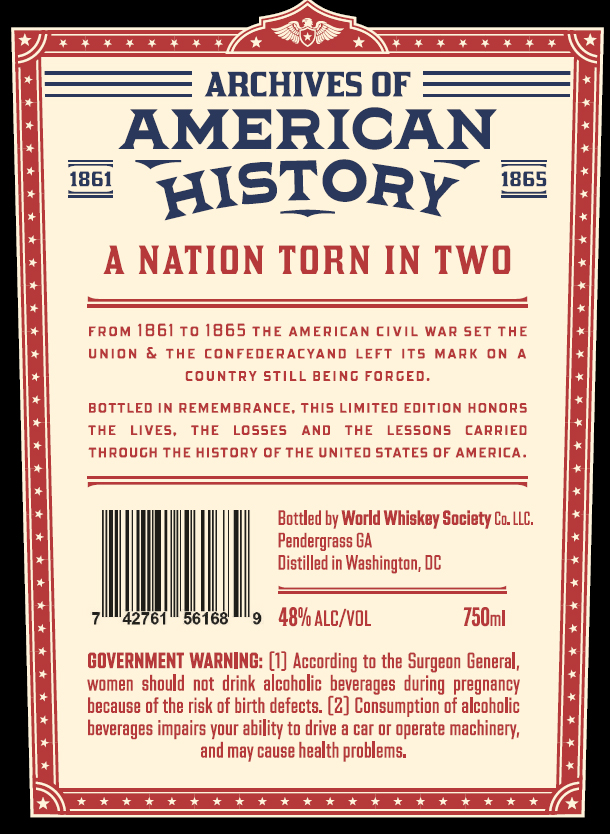
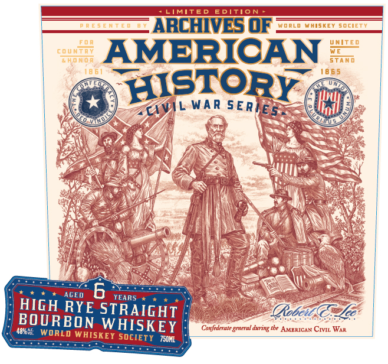
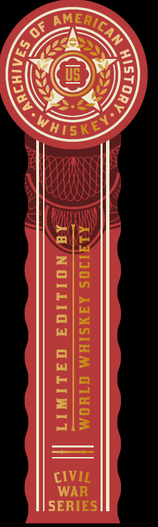

# TTB COLA Label Images - TTBID 26209001000361

**Brand Name:** ARCHIVES OF AMERICAN HISTORY

**Issue Date:** 08/14/2026

**Origin Code:** 08

**Product Class/Type:** 101

**Source:** [TTB Public COLA Registry](https://ttbonline.gov/colasonline/viewColaDetails.do?action=publicFormDisplay&ttbid=26209001000361)

## Label Images

### Back Label

### Front Label

### Label 2

## Extracted Label Text

*Text extracted via OCR - may contain errors*

**Detected Age:** 6 Years

### Back Label

ARCHIVES OF
AMERICAN
1861
HISTORY
1865
A
NATION TORN IN TWO
FROM 1861To 1865 THE AMERICAN CiVil WAR SET
THE
UNION
THE CONFEDERACYAND
LEFT its MARK
ON
country Still BEING FORCED_
BOTTLED IN REMEMBRANCE;
This LIMITED EdItion HONORS
THE
LIVES,
THE
LossEs
AND
THE
LESSONS
CARRIED
Through THE history OFTHE UnITed STATES @F AMERICA_
Bottled by World Whiskey Society Co. LLC;
Pendergrass BA
Distilled in Washington; DC
42761
56168
489 ALC/VOL
750ml
GOVERNMENT WARNING: [0] According to the Surgeon General;,
women should  not drink alcoholic  beverages during  pregnancy
because of the risk of birth defects: (2] Consumption of alcoholic
beverages impairs your ability to drive
car or operate machinery;
and may cause health problems;
1 *
1 *

### Front Label

LIMITED
EDITION
0RE 5 E MTE m
ARCHIVES OF
Wdrld WhiskeY socieTY
UNITED
coun
AMERICAN
6Hoor
stam
18 6 5
HISTORY
WAR
ES -
AGED
6
YEARS
HIGH RYE STRAIGHT
(Robee@:zec
BOURBON
485h55
WHISKEY
Confedrrate general €
tle AMERICAN CIVIL WaR
WORLD WHISKET SOCIETY
TS0ML
S E R
4VIL
duting

### Label 2

KOS
ZI <2
Ett Wiha
©) Nt Ys
QSEG
MHisKe
pi
a) eo
fet
Z\G
i— Ta
a|a
el
me) td
El] pe
|
| <=]
w|=
ela
=o
ZIs
als
CIVIL
WAR
SERIES
