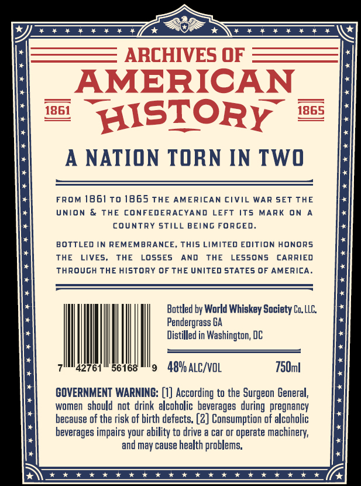
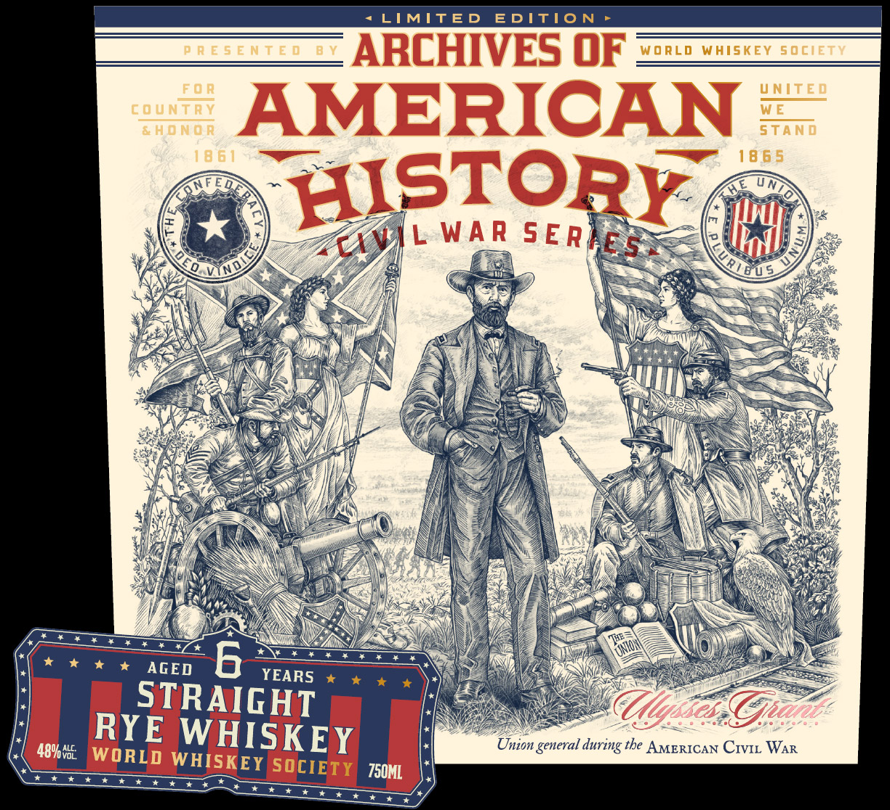
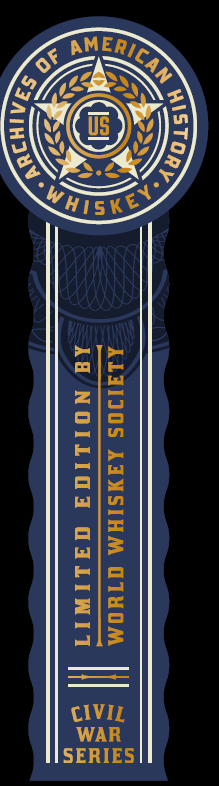

# TTB COLA Label Images - TTBID 26209001000368

**Brand Name:** ARCHIVES OF AMERICAN HISTORY

**Issue Date:** 08/04/2026

**Origin Code:** 08

**Product Class/Type:** 102

**Source:** [TTB Public COLA Registry](https://ttbonline.gov/colasonline/viewColaDetails.do?action=publicFormDisplay&ttbid=26209001000368)

## Label Images

### Back Label

### Front Label

### Label 2

## Extracted Label Text

*Text extracted via OCR - may contain errors*

**Detected Age:** 6 Years

### Back Label

ARCHIVES OF
AMERICAN
1864
HISTORY
1865
A NATION TORN IN TWO
FROM 1861t0 1865 THE AMERICAN CiviL
WAR
SET THE
UNION
THE
CONFE
EDERACYAND
LEFT
ITS
MARK
ON
coUntRY STilL BEING FORGED
BOTTLED IN REMEMBRANCE_
This LIMITED EDITION HONORS
THE
LIVES;
THE
LOssEs
AND
THE
LESSONS
CARRIED
Through THE history OFTHE UnITed STATES OF AMERICA_
Bottled by World Whiskey Society Lo. LLC
Pendergrass BA
Distilled in Washington; DC
42761
56168
489 alc/vol
750ml
GOVERNMENT WARNING: [0] According to the Surgeon General;
women   should not drink   alcoholic   beverages   during pregnancy
because of the risk of birth defects: (2] Consumption of alcoholic
beverages impairs your ability to drive a car or operate machinery;
and may cause health problems;
4 1+ 4
4 1 +
4 1

### Front Label

LIMITED
EDITIO N
P R E 5 E N t E 0
BV
ARCHIVES OF
WoRLD
Whiskey sociEt7
FCR
VNITE D
countrY
AMERICAN
W E
4HONOR
STAND
18 6 1
18 6 5
HISTORY
W A R
AGED
6
YEARS
STRAIGHT
(Ulyses Gpane
489hv85
RYE WHISKEY
Union general
the AMERICAN CIVIL WAR
WORLD WHISKEY SOCIETY
750ML
S ERAES
CVIL
during

### Label 2

S ERD
ENO
=| Nei Wr oy
3 Ni Ys

NEG

IS>
Tp
ale

ta
ZG
ojo
elm
el
=) ot
ane
wa)

=
a=
ela
Lott Reel
ZIs
ale
CIVIL
WAR
SERIES
