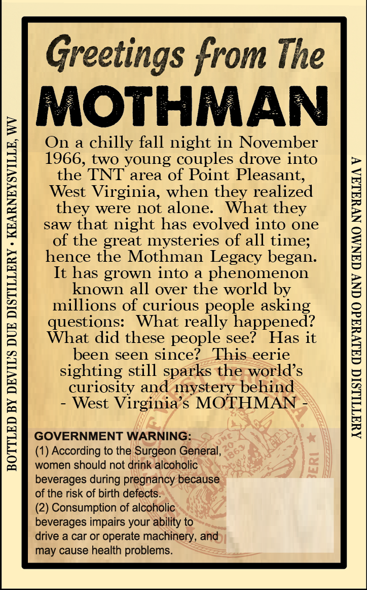
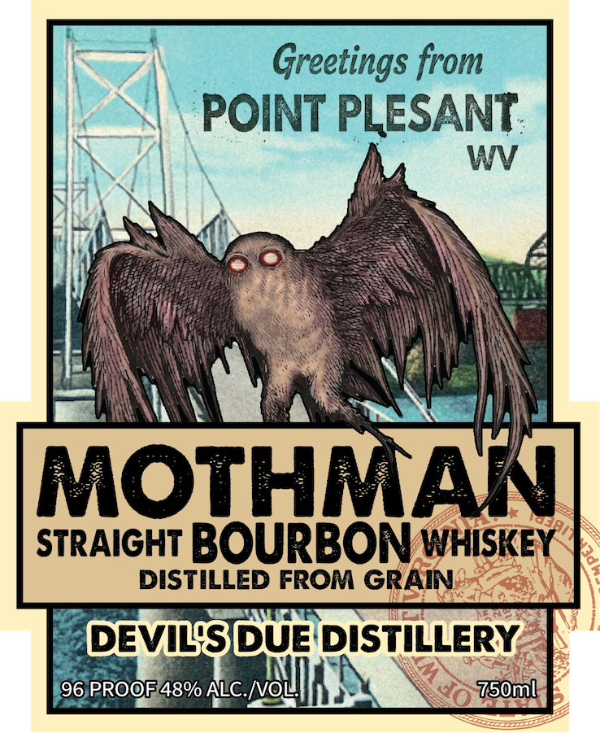
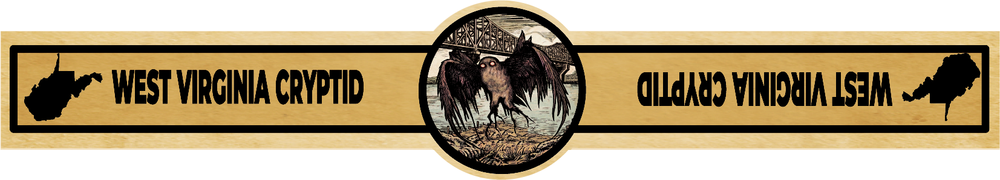

# TTB COLA Label Images - TTBID 26209001000411

**Brand Name:** DEVIL'S DUE DISTILLERY

**Fanciful Name:** WEST VIRGINIA CRYPTID SERIES POINT PLEASANT MOTHMAN BOURBON

**Issue Date:** 08/04/2026

**Origin Code:** 47

**Product Class/Type:** 101

**Source:** [TTB Public COLA Registry](https://ttbonline.gov/colasonline/viewColaDetails.do?action=publicFormDisplay&ttbid=26209001000411)

## Label Images

### Back Label

### Front Label

### Label 3

## Extracted Label Text

*Text extracted via OCR - may contain errors*

**Detected Proof:** 96

### Back Label

BOTTLED BY DEVIL'S DUE DISTILLERY » KEARNEYSVILLE, WV

Greetings from The

MOTHMAN

On a chilly fall night in November
1966, two young couples drove into
the TNT area of Point Pleasant,
West Virginia, when they realized
they were not alone. What they
saw that night has evolved into one
of the great mysteries of all time;
hence the Mothman Legacy began.
It has grown into a phenomenon
known all over the world by
millions of curious people asking
questions: What really happened?
What did these people see? Has it
been seen since? This_eerie
sighting still sparks the world’s
curiosity and mystery behind
- West Virginia’s MOTHMAN -

GOVERNMENT WARNING:

(1) According to the Surgeon General,
women should not drink alcoholic
beverages during pregnancy because
of the risk of birth defects.

(2) Consumption of alcoholic
beverages impairs your ability to

drive a car or operate machinery, and
may cause health problems.

AWATILISIC CGALVYAdO GNV GANMO NVYALAA V

### Front Label

Greetings from
POINT PLESANT:
WV
MOTHMAN
STRAIGHT BOURBON WHISKEY
DISTILLED FROM GRAIN
DEVISDUE DISTILLERY
CFS
96 PROOF48% ALC /VOL
750ml

### Label 3

WEST VIRCINIA CryPTID
dIkJk4) VINHDYIA LSM
