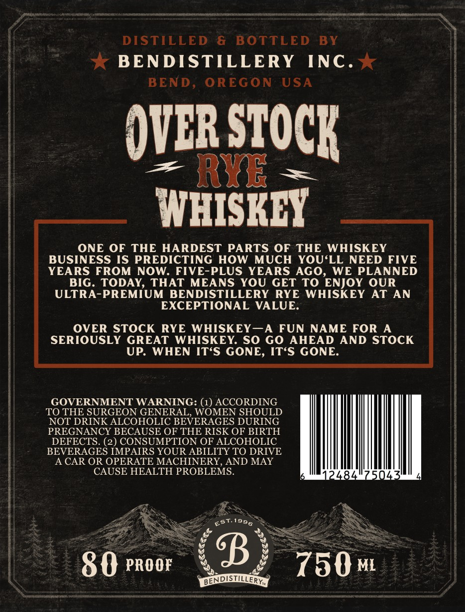
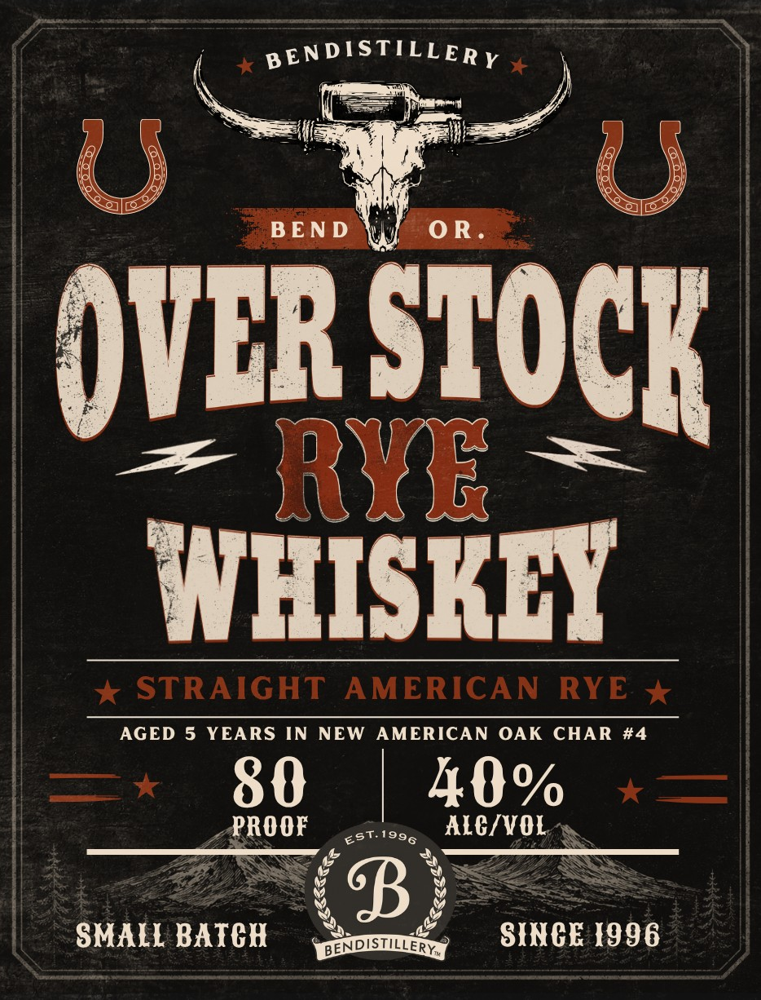

# TTB COLA Label Images - TTBID 26209001000424

**Brand Name:** OVER STOCK

**Issue Date:** 08/05/2026

**Origin Code:** 38

**Product Class/Type:** 102

**Source:** [TTB Public COLA Registry](https://ttbonline.gov/colasonline/viewColaDetails.do?action=publicFormDisplay&ttbid=26209001000424)

## Label Images

### Back Label

### Front Label

## Extracted Label Text

*Text extracted via OCR - may contain errors*

**Detected Proof:** 80
**Detected Age:** 5 Years

### Back Label

DISTILLED
6
BOTTLED
BY
BENDSTILLERY
INC .
BEND
OREGON
USA
OVCR STOCK
3
RYR
WHISKLY
ONE
OF THE HARDEST PARTS
OF THE
WHISKEY
BUSINESS IS PREDICTING HOW
MUCH
YOU'LL NEED
FIVE
YEARS
FROM
NOW_
FIVE-PLUS YEARS AGO,
WE PLANNED
BIG. TODAY
THAT MEANS
YOU
GET
TO ENJOY OUR
ULTRA-PREMIUM BENDISTILLERY
RYE
WHISKEY
AT AN
EXCEPTIONAL
VALUE:
OVER STOCK
RYE WHISKEY_A FUN
NAME FOR
A
SERIOUSLY GREAT
WHISKEY: SO GO AHEAD
AND STOCK
UP:
WHEN IT'S GONE, ITS GONE:
GOVERNMENT WARNING: (1) ACCORDING
TO THE SURGEON GENERAL, WOMEN SHOULD
NOT DRINK ALCOHOLIC BEVERAGES DURING
PREGNANCY BECAUSE OF THE RISK OF BIRTH
DEFECTS. (2) CONSUMPTION OF ALCOHOLIC
BEVERAGES IMPAIRS YOUR ABILITY TO DRIVE
A CAR OR OPERATE MACHINERY, AND MAY
CAUSE HEALTH PROBLEMS.
2484
50.3
80 PROOF
8
750mi
DENDISTILLERY
EsT
1996

### Front Label

BEN DISTILLER Y
U
U
BEN D
0 R
OVER STOCK
3
RYRE
WHISKEY
STRAIGHT
AMERICAN
RYE
AGED 5 YEARS
IN
NEW
AMERICAN OAK
CHAR
#4
80
40%
PROOF
Est.1996
ALCIVOL
8
SMALL BATCH
BENDISTILLERY
SINCE I996
