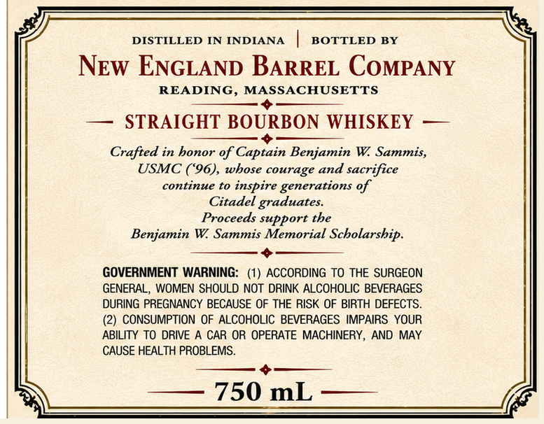
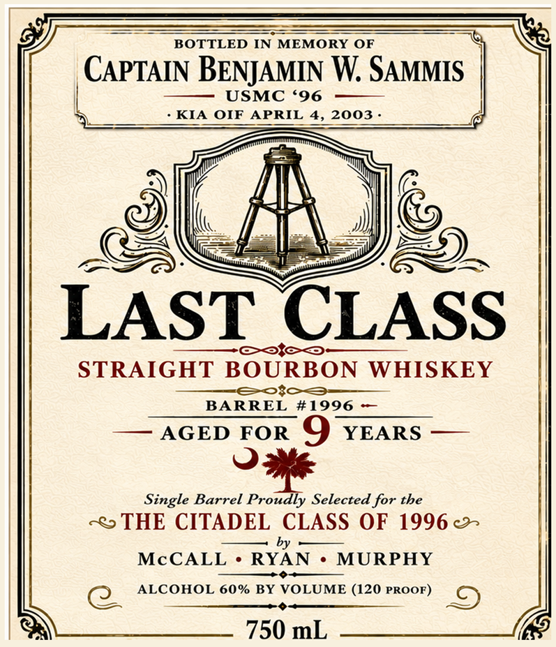

# TTB COLA Label Images - TTBID 26209001000432

**Brand Name:** LAST CLASS

**Fanciful Name:** BARREL # 1996

**Issue Date:** 08/04/2026

**Origin Code:** 26

**Product Class/Type:** 101

**Source:** [TTB Public COLA Registry](https://ttbonline.gov/colasonline/viewColaDetails.do?action=publicFormDisplay&ttbid=26209001000432)

## Label Images

### Back Label

### Front Label

## Extracted Label Text

*Text extracted via OCR - may contain errors*

**Detected Proof:** 120
**Detected Age:** 9 Years

### Back Label

DISTILLED IN INDIANA
BOTTLED BY
NEw ENGLAND BARREL COMPANY
READING, MASSACHUSETTS
STRAIGHT BOURBON WHISKEY
Crafted in bonor of Captain Benjamin W Sammis,
USMC (*96), wbose courage and sacrifice
continue to inspire generations %f
Citadel graduates
Proceeds support tbe
Benjamin W
Sammis Memorial Scbolarsbip.
GOVERNMENT WARNING:
ACCORDING To THE SURGEON
GENERAL, WOMEN SHOULD NOT DRINK ALCOHOLIC BEVERAGES
DURING PREGNANCY BECAUSE OF THE RISK OF BIRTH DEFECTS_
(2) CONSUMPTION OF ALCOHOLIC BEVERAGES IMPAIRS YOUR
ABILITY TO DRIVE
CAR OR OPERATE MACHINERY,
AND MAY
CAUSE HEALTH PROBLEMS.
750 mL

### Front Label

BOTTLED IN MEMORY OF
CAPTAIN BENJAMIN W SAMMIS
USMC *96
KIA
OIF
APRIL
4, 2003
LAST CLASS
STRAIGHT
BOURBON
WHISKEY
BARREL #1996
AGED FOR
9
YEARS
Single Barrel Proudly Selected for tbe
THE CITADEL CLASS OF 1996
by
McCALL
RYAN
MURPHY
ALCOHOL 60% BY VOLUME (120 PROOF)
750 mL
