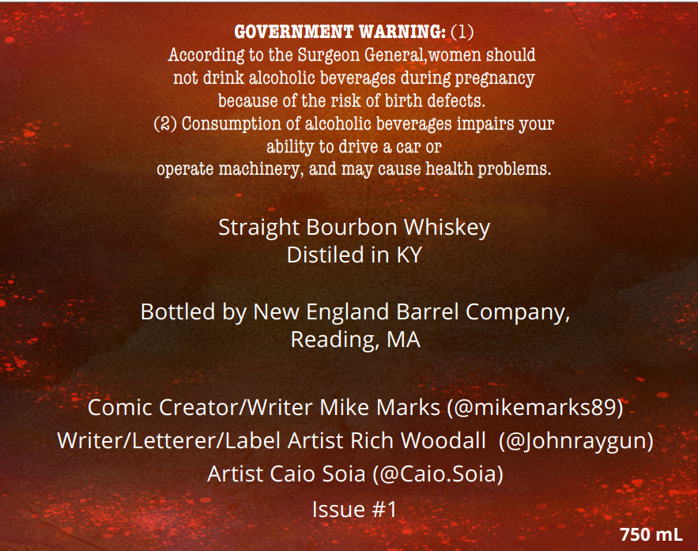
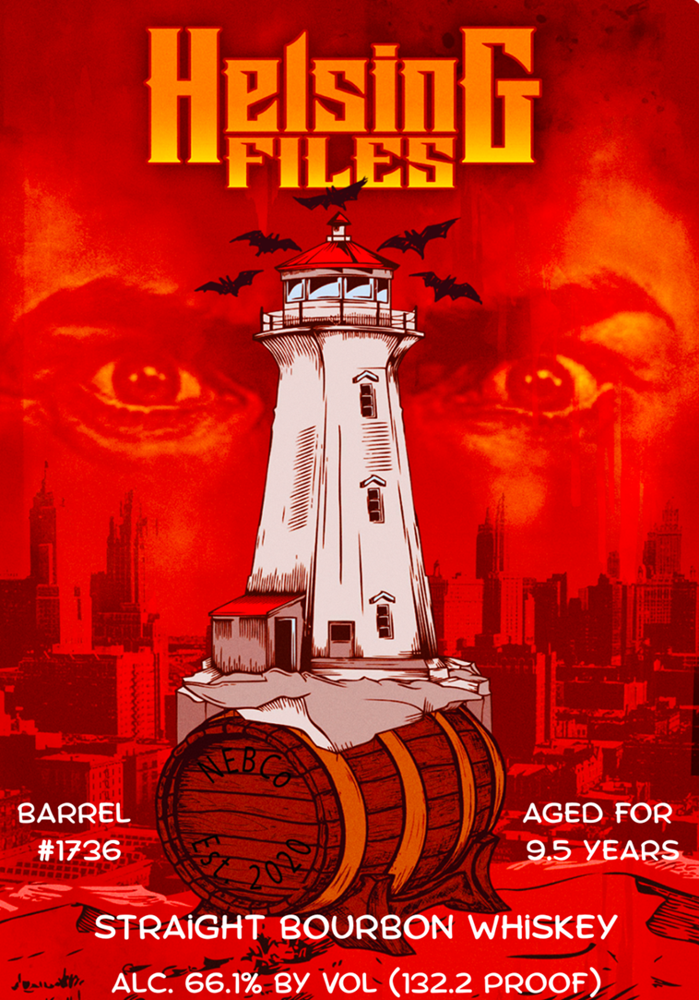

# TTB COLA Label Images - TTBID 26209001000434

**Brand Name:** HELSING FILES

**Issue Date:** 08/07/2026

**Origin Code:** 26

**Product Class/Type:** 101

**Source:** [TTB Public COLA Registry](https://ttbonline.gov/colasonline/viewColaDetails.do?action=publicFormDisplay&ttbid=26209001000434)

## Label Images

### Back Label

### Front Label

## Extracted Label Text

*Text extracted via OCR - may contain errors*

**Detected Age:** 9.5 Years

### Back Label

GOVERNMENT WARNING: (1)
According to the Surgeon General,women should
not drink alcoholic beverages during pregnancy
because of the risk of birth defects.
Consumption of alcoholic beverages impairs your
ability to drive & car Or
operate machinery, and may cause health problems __
Straight Bourbon Whiskey
Distiled in KY
Bottled by New England Barrel Company,
Reading MA
Comic Creator/Writer Mike Marks (@mikemarks89)
Writer/Letterer/Label Artist Rich Woodall (@Johnraygun)
Artist Caio Soia (@Caio.Soia)
Issue #1
750 mL

### Front Label

HeleiqG
MMML
BARREL
AGED FOR
#1736
9.5 YEARS
STRAIGHT: BOURBON WHiSKEY
Je"na
ALc: 66.1%-By VOL (132.2,PROOE)
