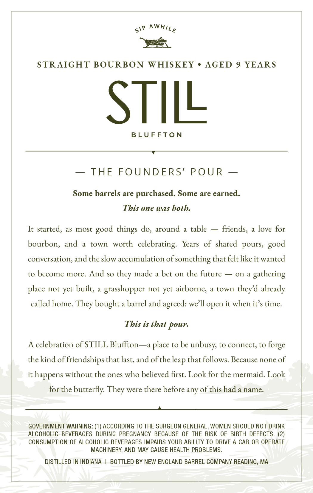
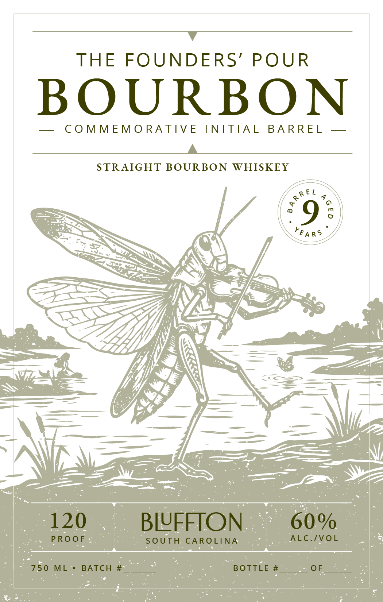

# TTB COLA Label Images - TTBID 26209001000445

**Brand Name:** BLUFFTON

**Fanciful Name:** THE FOUNDERS' POUR

**Issue Date:** 08/04/2026

**Origin Code:** 26

**Product Class/Type:** 101

**Source:** [TTB Public COLA Registry](https://ttbonline.gov/colasonline/viewColaDetails.do?action=publicFormDisplay&ttbid=26209001000445)

## Label Images

### Back Label

### Front Label

## Extracted Label Text

*Text extracted via OCR - may contain errors*

**Detected Proof:** 120
**Detected Age:** 9 Years

### Back Label

STRAIGHT BOURBON
WHISKEY
AGED 9 YEARS
STILL
B L U FFToN
THE
FOUNDERS'
P OU R
Some barrels are
purchased. Some are earned.
Tbis one was botb.
It started, as most
do, around
table
friends;
love for
bourbon;
and
town
worth   celebrating:
Years
of  shared
pours,
conversation, and the slow accumulation of =
something that felt like it wanted
to become more. And so
made a bet on the future
on
gathering
place not yet built;
grasshopper not yet airborne;
a town
theyd already
called home_
bought
barrel and agreed: we Il open it when it $ time
Tbis is tbat pour:
celebration of STILL Bluffton -~a place to be
unbusy,
to connect; to
the kind of friendships that
and of the
that follows. Because none of
it
happens without the ones who believed first: Look for the mermaid. Look
for the butterfly:
were
there before any of this hada name:
GOVERNMENT WARNING: (1) ACCORDING TO THE SURGEON GENERAL, WOMEN SHOULD NOT DRINK
ALCOHOLIC   BEVERAGES  DURING
PREGNANCY BECAUSE OF THE
RISK OF BIRTH DEFECTS. (2)
CONSUMPTION OF ALCOHOLIC BEVERAGES IMPAIRS YOUR ABILITY TO DRIVE A CAR OR OPERATE
MACHINERY, AND MAY CAUSE HEALTH PROBLEMS
DISTILLED IN INDIANA
BOTTLED BY NEW ENGLAND BARREL COMPANY READING, MA
AWHILE
SIP
good
things
good
they
They
forge
last,
leap -
They

### Front Label

THE
FOUNDERS'
POUR
BOURBON
C O MMEMO RATIV E
INITIA L
BA RRE L
STRAIGHT BOURBON
WHISKEY
9
G
120
BLUFFTON
60%
PROOF
SOUTH
CAROLINA
ALC./VOL
750
ML
BATCH
BOTTLE
OF_
R R E /
YEA RS
