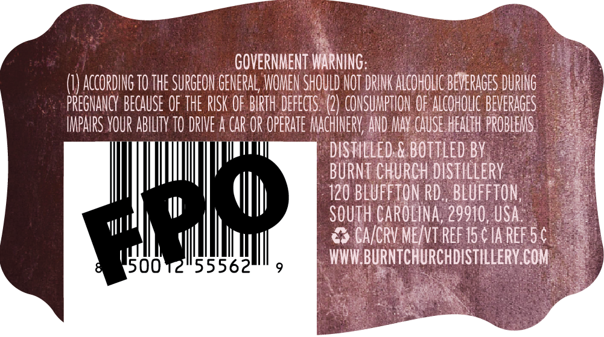
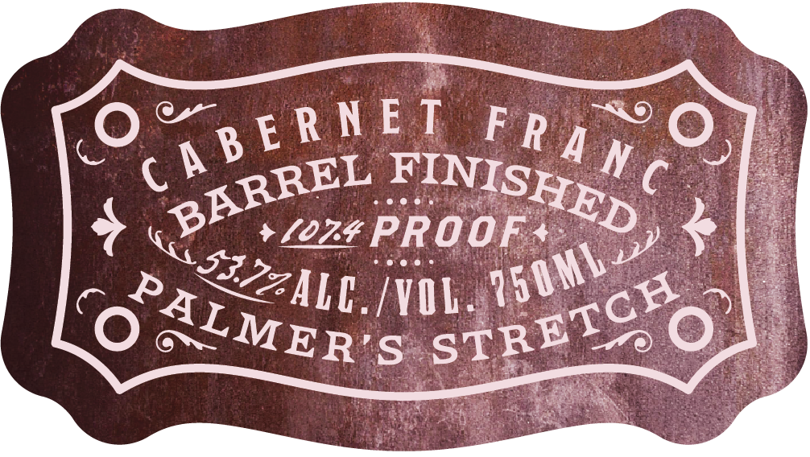

# TTB COLA Label Images - TTBID 26209001000627

**Brand Name:** PALMERS STRETCH

**Fanciful Name:** BARREL FINISHED

**Issue Date:** 08/05/2026

**Origin Code:** 41

**Product Class/Type:** 142

**Source:** [TTB Public COLA Registry](https://ttbonline.gov/colasonline/viewColaDetails.do?action=publicFormDisplay&ttbid=26209001000627)

## Label Images

### Back Label

### Front Label

## Extracted Label Text

*Text extracted via OCR - may contain errors*

*1 image(s) excluded: text did not meet readability threshold*

### Back Label

GOVERNMENT WARNINg:
AcCORDING TO THE SURGEON GENERAL; WOMEN SHOULD NOT DRINK ALcOHOLC BEVERAGES DURING
PREGNANcY BECAUSE OF THE RISK OF BIRTH DEFEcTS (2) CONSUMPTHON OF ALcOHOLC BEVERAGES
ImpaRS VOUR ABILITY TO DRIVE a car OR OPERATE MAcHINERV; AND MAY CAUSE HEALTH PROBLEMS
dStLLed & BOTTLEd BY
BURNT CHURCH dISTILLERY
120 BLUFFTON RD , BLUFFTON,
SOuTh CAROLINa; 29910,USA
CA/cRV Me/vt ReF 15 € Ia ReF 54
55562
WWW BURNTCHURCHDISTILLERY COM
