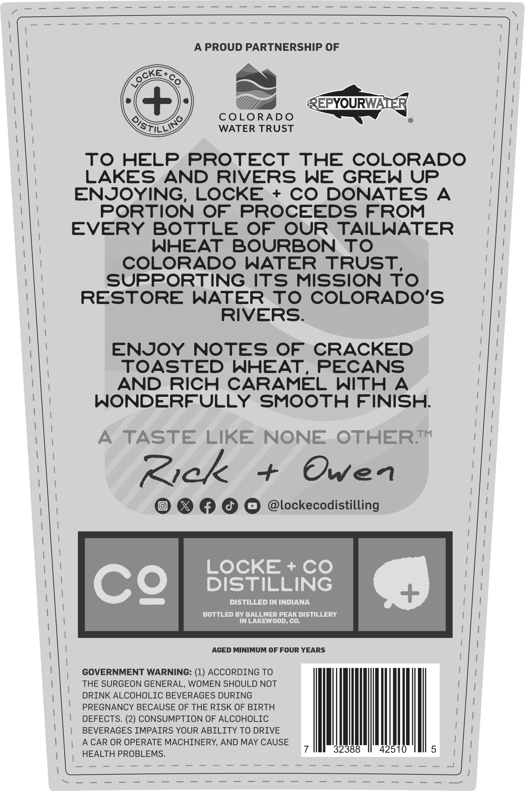
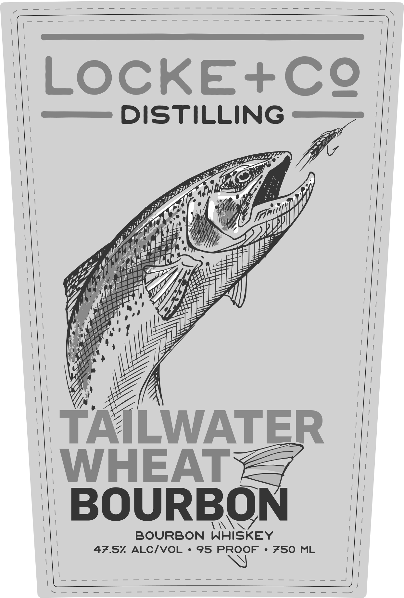

# TTB COLA Label Images - TTBID 26209001000677

**Brand Name:** LOCKE + CO DISTILLING

**Issue Date:** 08/10/2026

**Origin Code:** 13

**Product Class/Type:** 141

**Source:** [TTB Public COLA Registry](https://ttbonline.gov/colasonline/viewColaDetails.do?action=publicFormDisplay&ttbid=26209001000677)

## Label Images

### Back Label

### Front Label

## Extracted Label Text

*Text extracted via OCR - may contain errors*

**Detected Proof:** 95

### Back Label

PROUD PARTNERSHIP OF
REPYOURWATEI
COLORADO
OSTLL/9
WATER TRUST
To HELP
PROTECT
THE
COLORADO
LAKES
AND RIVERS
WE
GREW UP
ENJOYING,
LOCKE
+
Co
DONATES
A
PORTION OF
PROCEEDS FROM
EVERY
BOTTLE
OF
OUR
TAILWATER
WHEAT
BOURBON To
COLORADO
WATER
TRUST
SUPPORTING
ITS MISSION To
RESTORE
WATER
To COLORADO'S
RIVERS.
ENJOY
NOTES OF
CRACKED
TOASTED
WHEAT_
PECANS
AND
RICH CARAMEL
With
A
WONDERFULLY
SMOOTH FINISH:
TASTE LIkE NONE
OTHERTM
Zick
Owen
9
@lockecodistilling
LOCKE
Co
CQ
DISTILLING
DISTILLeD IN INDIANA
BOTTLED BY BALLMER PEAK DISTILLERY
IN LAKEWOOD; CO:
AGED MINIMUM OF FOUR YEARS
GOVERNMENT WARNING: (1) ACCORDING TO
THE SURGEON GENERAL, WOMEN SHOULD NOT
DRINK ALCOHOLIC BEVERAGES DURING
PREGNANCY BECAUSE OF THE RISK OF BIRTH
DEFECTS. (2) CONSUMPTION OF ALCOHOLIC
BEVERAGES IMPAIRS YOUR ABILITY TO DRIVE
A CAR OR OPERATE MACHINERY,
AND MAY CAUSE
32388
42510
HEALTH PROBLEMS.
OCKE

### Front Label

LOCKEINcC?
DISTILLING
TAILWATER
WHEAT
BOURBON
BOURBON
WHISKEY
47.57
ALCIVOL
95 PROOF
750
ML
