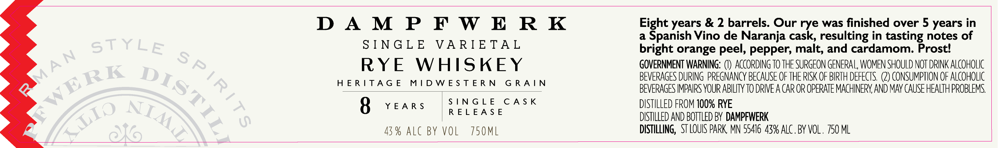

# TTB COLA Label Images - TTBID 26209001000703

**Brand Name:** DAMPFWERK

**Issue Date:** 08/07/2026

**Origin Code:** 27

**Product Class/Type:** 142

**Source:** [TTB Public COLA Registry](https://ttbonline.gov/colasonline/viewColaDetails.do?action=publicFormDisplay&ttbid=26209001000703)

## Label Images

### Label 1

## Extracted Label Text

*Text extracted via OCR - may contain errors*

**Detected Proof:** 86
**Detected Age:** 8 Years

### Label 1

DAMPFWERK

SINGLE VARIETAL

RYE WHISKEY

HERITAGE MIDWESTERN GRAIN

8 YEARS

43% ALC BY VOL 750ML

SINGLE CASK
RELEASE

Eight years & 2 barrels. Our rye was finished over 5 years in
a Spanish Vino de Naranja cask, resulting in tasting notes of
bright orange peel, pepper, malt, and cardamom. Prost!
GOVERNMENT WARNING: (I) ACCORDING TO THE SURGEON GENERAL WOMEN SHOULD NOT DRINK ALCOHOLIC
BEVERAGES DURING PREGNANCY BECAUSE OF THE RISK OF BIRTH DEFECTS. (2) CONSUMPTION OF ALCOHOLIC
BEVERAGES IMPAIRS YOUR ABILITY TO DRIVE A CAR OR OPERATE MACHINERY, AND MAY CAUSE HEALTH PROBLEMS.
DISTILLED FROM 100% RYE

DISTILLED AND BOTTLED BY DAMPFWERK

DISTILLING, STLOUIS PARK, MN 55416 43% ALC. BY VOL. 750 ML
