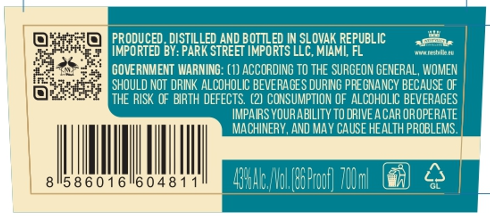
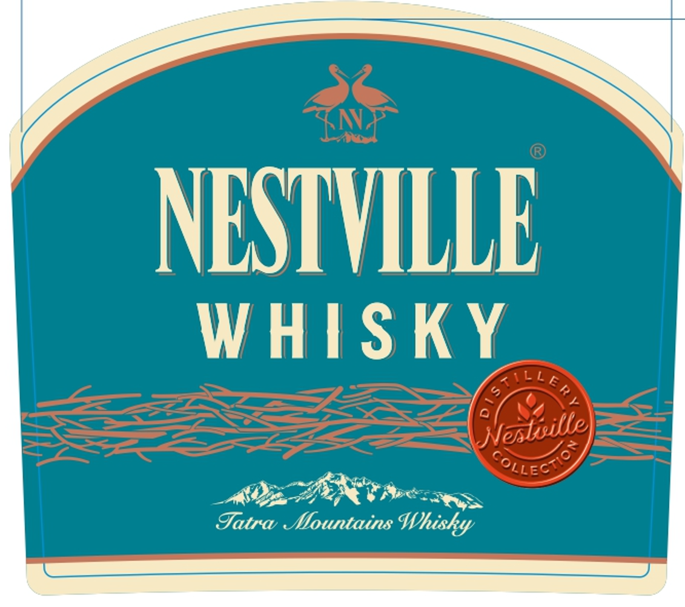

# TTB COLA Label Images - TTBID 26209001000716

**Brand Name:** NESTVILLE

**Fanciful Name:** SINGLE MALT

**Issue Date:** 08/04/2026

**Origin Code:** 5O

**Product Class/Type:** 118

**Source:** [TTB Public COLA Registry](https://ttbonline.gov/colasonline/viewColaDetails.do?action=publicFormDisplay&ttbid=26209001000716)

## Label Images

### Back Label

### Front Label

## Extracted Label Text

*Text extracted via OCR - may contain errors*

### Back Label

PRODUCED, DISTILLED AND BOTTLED IN SLOVAK REPUBLIC

aero

bed

IMPORTED BY: PARK STREET IMPORTS LLC, MIAMI, FL

wwe neshelle. eu

GOVERNMENT WARNING: (1) ACCORDING TO THE SURGEON GENERAL, WOMEN

SHOULD NOT DRINK ALCOHOLIC BEVERAGES DURING PREGNANCY BECAUSE OF

THE RISK OF BIRTH DEFECTS. (2) CONSUMPTION OF ALCOHOLIC BEVERAGES

IMPAIRS YOUR ABILITY TO DRIVE ACAR OROPERATE

MACHINERY, AND MAY CAUSE HEALTH PROBLEMS

|

|

|

|

rT

6016"604

‘g) <S

‘Nol (B0Proof

### Front Label

NESTVILLE

WHISKY

AAR Boe

Futra Mountains W) hishy
