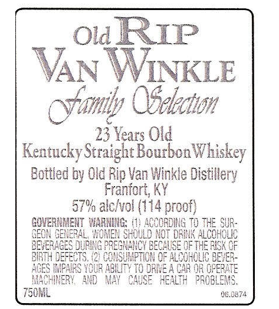
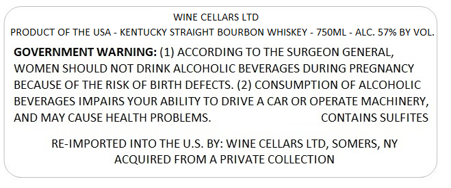
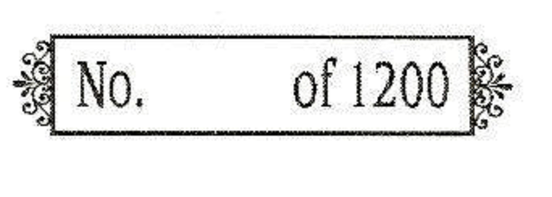
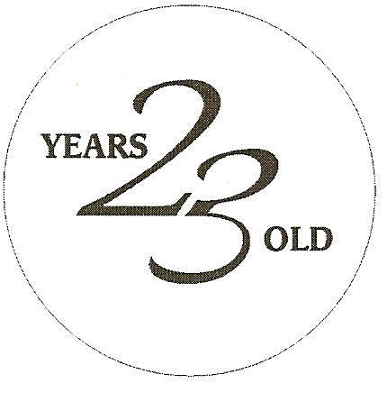

# TTB COLA Label Images - TTBID 26209001000806

**Brand Name:** WINE CELLARS LTD

**Issue Date:** 08/05/2026

**Origin Code:** 00

**Product Class/Type:** 101

**Source:** [TTB Public COLA Registry](https://ttbonline.gov/colasonline/viewColaDetails.do?action=publicFormDisplay&ttbid=26209001000806)

## Label Images

### Back Label

### Label 1

### Label 3

### Label 4

## Extracted Label Text

*Text extracted via OCR - may contain errors*

*2 image(s) excluded: text did not meet readability threshold*

**Detected Proof:** 114
**Detected Age:** 23 Years

### Back Label

Ol RIP
VAN WNKLE
Ofeleciton
23 Years Old
Kentucky Straight Bourbon
Bottied by Old Rip Van Winkle Distillery
Franfcrt, KY
57% alclvol (114 proof)
GWVERNMENT WAANINe:
ACCORDING To ThE SuR-
GeoN GENERAL,  'OMEW SHouLD NoT @RUNK ALCOHOLC
BEVERAGES DUphG PRESWANCY EECHUSE Qe ThE EUSK
BIRTH DEFEcTS, (2) ConsunftIOM OF ALcOHOLIC BEES
AGES EPAIES YoUR AElLIT} To DRME A CAR @R OFEHE
MACHNERY
W
MAY
CAUSE   REALTH   PSOELEM:
750ML
CG.0374
Oamil
Whiskey

### Label 1

WINE CELLARS LTD
PRODUCT OF THE USA _
KENTUCKY STRAIGHT BOURBON WHISKEY
75OML
ALC. 57% BY VOL
GOVERNMENT WARNING: (1) ACCORDING TO THE SURGEON GENERAL,
WOMEN SHOULD NOT DRINK ALCOHOLIC BEVERAGES DURING PREGNANCY
BECAUSE OF THE RISK OF BIRTH DEFECTS. (2) CONSUMPTION OF ALCOHOLIC
BEVERAGES IMPAIRS YOUR ABILITY TO DRIVE A CAR OR OPERATE MACHINERY,
AND MAY CAUSE HEALTH PROBLEMS_
CONTAINS SULFITES
RE-IMPORTED INTO THE U.S
BY: WINE CELLARS LTD, SOMERS, NY
ACQUIRED FROMA PRIVATE COLLECTION
