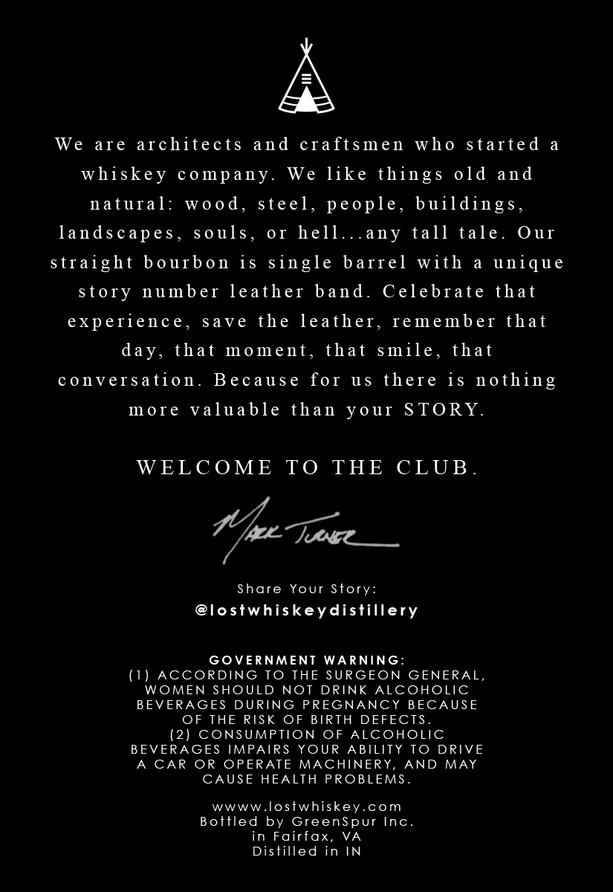
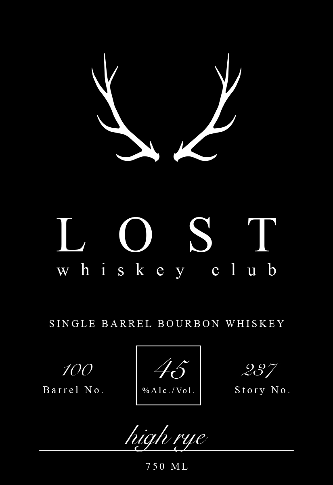

# TTB COLA Label Images - TTBID 26209001000814

**Brand Name:** LOST WHISKEY CLUB

**Issue Date:** 08/04/2026

**Origin Code:** 05

**Product Class/Type:** 141

**Source:** [TTB Public COLA Registry](https://ttbonline.gov/colasonline/viewColaDetails.do?action=publicFormDisplay&ttbid=26209001000814)

## Label Images

### Back Label

### Label 1

## Extracted Label Text

*Text extracted via OCR - may contain errors*

### Back Label

We
aTe
architects
and craftsmen
who
started
whiskey
co mpany
We
like things old and
natural:
Wo0d,
steel_
people, buildings ,
landscapes _
s 0uls_
0T hell.
any tall tale.
Ou1
straight bourbon is single bafrel
with
unique
story number eather band.
Celebrate that
experience
sa Ve the leather, remember that
that
m 0 ment_
that smile_
that
conversation.
Becaus e
for
u5
there is nothing
m 0 T e
valuable
than
youI STORY.
WELC OME
TO
THE
CLUB _
ak Juxe
Share Your Story:
@lostwhiskeydisfillery
GOVERNMENT
WARNING:
(I) AccoRDING TO THE SURGEON GENERAL,
WOMEN SHOULD
NOT
DRINK ALCOHOLIc
BEVERAGES DURING PREGNANCY BECAUSE
OF THE RISK OF BIRTH DEFECTS
(2) CONSUMPTION OF ALCOHOLIC
BEVERAGES IMPAIRS YOUR
ABILITY To DRIVE
CAR
OR
OPERATE MACHINERY_
AND
MAY
CAUSE HEALTH PROBLEMS
WWWW
losfwhiskey.com
Boffled by GreenSpur Inc
in Fairfax,
VA
Distilled in IN
day ,

### Label 1

Kz

LOST

club

whiskey

SINGLE BARREL BOURBON WHISKEY

7OO

FS

237

Barrel No.

%Alc./Vol.

Story No

high ye

750 ML
