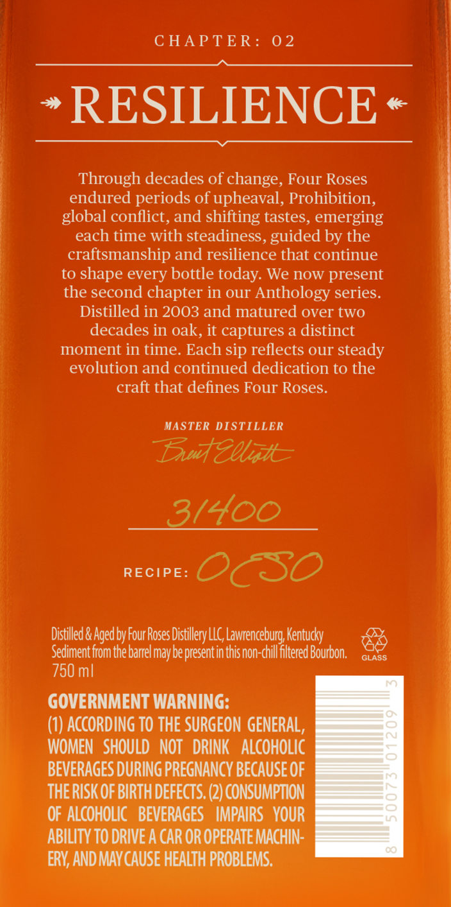
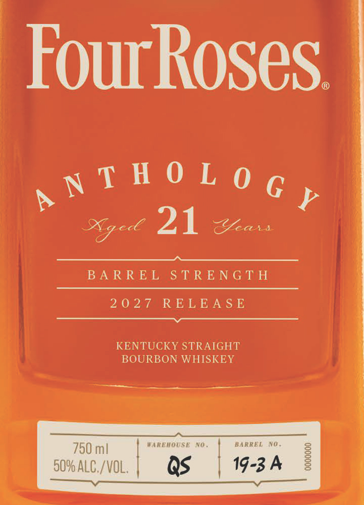
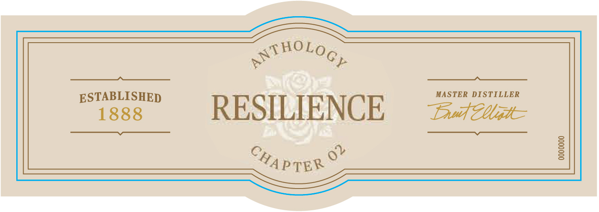

# TTB COLA Label Images - TTBID 26209001000854

**Brand Name:** FOUR ROSES

**Fanciful Name:** ANTHOLOGY

**Issue Date:** 08/05/2026

**Origin Code:** 22

**Product Class/Type:** 101

**Source:** [TTB Public COLA Registry](https://ttbonline.gov/colasonline/viewColaDetails.do?action=publicFormDisplay&ttbid=26209001000854)

## Label Images

### Back Label

### Front Label

### Label 3

## Extracted Label Text

*Text extracted via OCR - may contain errors*

**Detected Proof:** 100

### Back Label

C HAPTER:
02
RESILIENCE
Through decades of change, Four Roses
endured periods of upheaval, Prohibition,
global conflict, and shifting tastes, emerging
each time with steadiness, guided by the
craftsmanship and resilience that continue
to shape every bottle today: We now present
the second chapter in Our Anthology series__
Distilled in 2003 and matured over two
decades in oak, it captures a distinct
moment in time. Each sip reflects our steady
evolution and continued dedication to the
craft that defines Four Roses
MASTER DISTILLER
Euteeatt
3/400
RECIPE:
CSO
Distilled & Aged by Four Roses DistilleryLLC, Lawrenceburg Kentucky
Sedimentfrom the barrel may be presentin thisnon-chill fltered Bourbon.
GLASS
750 ml
GOVERNMENT WARNING:
(1) AccORDINg TO THE SURGEON GENERAL,
WOMEN   SHOULD   NOT   DRINK   ALcoHOLIC
BEVERAGES DURING PREGNANCY BECAUSE OF
THERISK OF BIRTH defects. (2) CONSUMPTION
OF ALCOHOLIC   BEVERAGES   IMPAIRS   VOUR
ABILITV TO DRIVE A CAR OR OPERATE MACHIN:
ERY; AND MAY CAUSE HEALTH PROBLEMS.

### Front Label

FourRoses.

tye DA Bin

BARREL STRENGTH

2027 RELEASE

KENTUCKY STRAIGHT
BOURBON WHISKEY

750 ml!

50% ALC./VOL. L
—_- crm

### Label 3

yHOLG
> Cp

eae RESILIE NCE MASTER een

wha

©,
@4 ppyk
