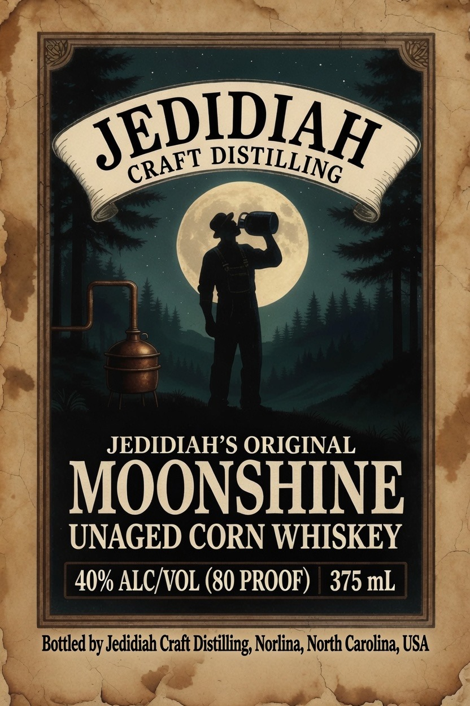
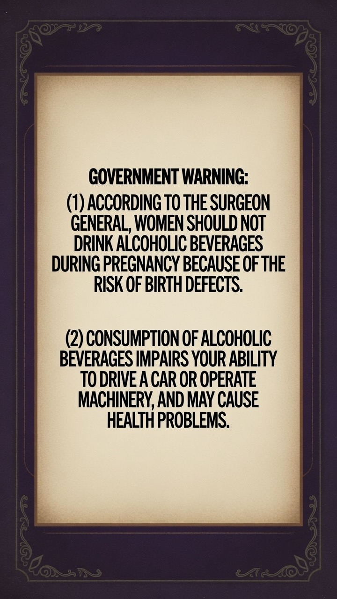

# TTB COLA Label Images - TTBID 26209001000885

**Brand Name:** JEDIDIAH CRAFT DISTILLING

**Fanciful Name:** MOONSHINE CORN WHISKY

**Issue Date:** 08/06/2026

**Origin Code:** 35

**Product Class/Type:** 143

**Source:** [TTB Public COLA Registry](https://ttbonline.gov/colasonline/viewColaDetails.do?action=publicFormDisplay&ttbid=26209001000885)

## Label Images

### Label 1

### Label 2

## Extracted Label Text

*Text extracted via OCR - may contain errors*

**Detected Proof:** 80

### Label 1

JEPIDIAH
JEDIDIAHS ORIGINAL
MOONSHINE
UNAGED CORN WHISKEY
40% ALC VOL (80 PROOF)
375 mL
Bottled by Jedidiah Craft Distilling; Norlina, North Carolina; USA
DISTILLING
CRAFT

### Label 2

GOVERNMENT WARNING:
ACCORDING TO THE SURGEON
GENERAL; WOMEN SHOULD NOT
DRINK ALCOHOLIC BEVERAGES
DURING PREGNANCY BECAUSE OF THE
RISK OF BIRTH DEFECTS
(2) CONSUMPTION OF ALCOHOLIC
BEVERAGES IMPAIRS YOUR ABILITY
TO DRIVE A CAR OR OPERATE
MACHINERY, AND MAY CAUSE
HEALTH PROBLEMS
Qox A>
