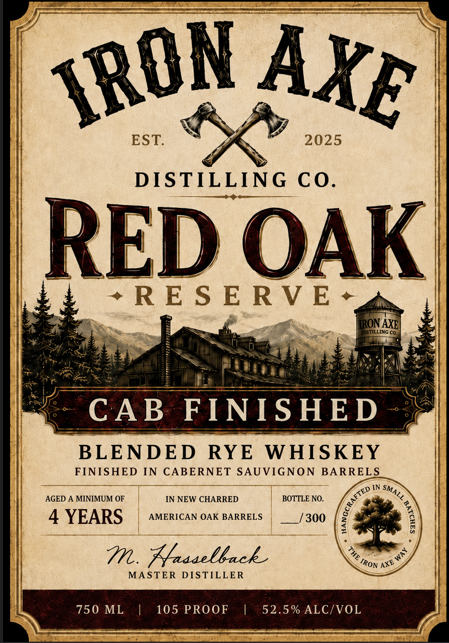
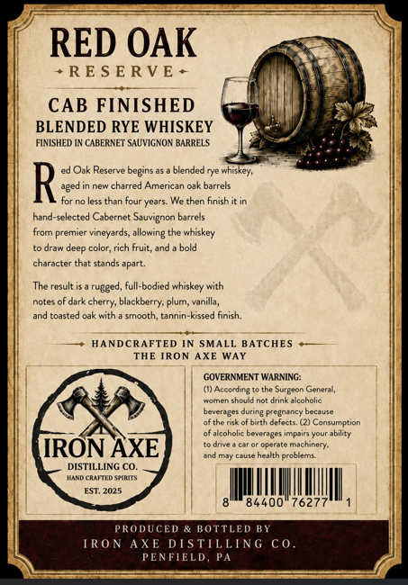

# TTB COLA Label Images - TTBID 26210001000075

**Brand Name:** IRON AXE

**Fanciful Name:** RED OAK RESERVE

**Issue Date:** 08/24/2026

**Origin Code:** 39

**Product Class/Type:** 132

**Source:** [TTB Public COLA Registry](https://ttbonline.gov/colasonline/viewColaDetails.do?action=publicFormDisplay&ttbid=26210001000075)

## Label Images

### Front Label

### Label 2

## Extracted Label Text

*Text extracted via OCR - may contain errors*

**Detected Proof:** 105
**Detected Age:** 4 Years

### Front Label

EST
2025
DISTILLING CO_
RED OAK
~RE S E R V E
ONAXE
CAB
FINISHED
BLENDED
RYE
WHISKEY
FINISHED IN CABERNET SAUVIGNON
BARRELS
AGED
MinILU (F
INNFW CHARRED
HOTARO
4 YEARS
AMERICAA OAK BARRELS
7300
m. Hlassellack
MASTER DISTILLER
750 ML
105 PROOF
52.5% ALC/VOL
IRON
AXE
Irot

### Label 2

RED OAK
RE S E RVE
CAB FINISHED
BLENDED RYE WHISKEY
FINLSHED IN CABERNET SAUVIGNON BARRELS
Oak Reserve begins
blended rye whiskey;
R
aged
new charrec
Lmerican
oak barrels
than four years
We then finish it =
hand-selected Cabernet Sauvignon barrels
from premier vineyards
the whiskey
draw
deed ccior
rich fruit; and
bold
characte
that stands
The result
rugged, full-bodied whiskey with
notes
durk =
blackberry: plurn, vanilla_
toasted oak with
smooth
tannin-kissed finish.
HANDCRAFTED IN SMALL BATCHES
THE RON AXE WAY
GOVERNMENT WARNING:
(I) Acccrd n&
Surgeon Genera ,
nomenieud
JrinkArroholic
beverages during Prcgnancy because
ofthe nsk of birth Oofocts. (2)
Consumption
akcoholic beverages impairs your ability
Oderate Mac Dinegy=
IRON AXE
ano May ceuse health Orcblemi
DISTILLING CO.
Malchanheik
CWEea
84400
7627
PRODUCED * KOTTLED KY
IRON AXE DISTILLING C0
PENFIELD, Pa
allonng
JPIrt
chery:
