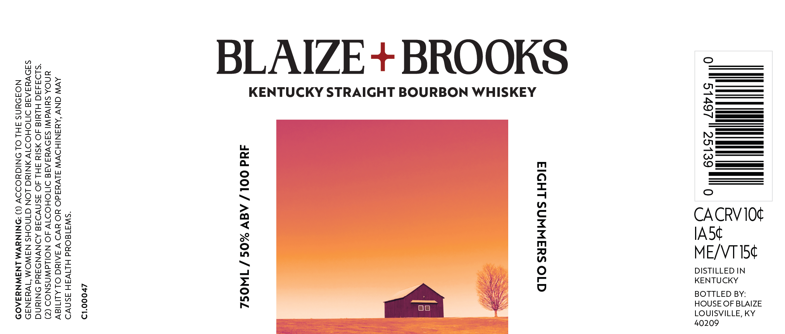

# TTB COLA Label Images - TTBID 26210001000159

**Brand Name:** BLAIZE + BROOKS

**Issue Date:** 08/04/2026

**Origin Code:** 22

**Product Class/Type:** 101

**Source:** [TTB Public COLA Registry](https://ttbonline.gov/colasonline/viewColaDetails.do?action=publicFormDisplay&ttbid=26210001000159)

## Label Images

### Back Label

## Extracted Label Text

*Text extracted via OCR - may contain errors*

### Back Label

on" 51497 © 25139 8" 0

CACRV 10¢

IA5¢
ME/VTI5¢

DISTILLED IN
KENTUCKY
HOUSE OF BLAIZE
LOUISVILLE, KY

BOTTLED BY:
40209

EIGHT SUMMERS OLD

KENTUCKY STRAIGHT BOURBON WHISKEY

dud OOL/ AGV %OS / INOSZ

BLAIZE+ BROOKS

£v000'1D

“swa1dOud HLIV4H ASNVD

AWW CNV ‘AYANIHOVW JLVuddO YO YVO V JAIN OLALITIAV
YNOA SUlVd WI SADVYAAIE DITIOHODTV AO NOILdWNSNOD (Z)
*"SLO4440 HLYId SO ASIY FHL AO ASNVDAG ADNVND3AUd ONINNG
SADVYAAIE OMOHODTV ANING LON GINOHS NAWOM “Tva4Na9
NOJ9uNS FHL OL ONIGUODSV (1) ‘DNINYVM LNSWNYFAOD
