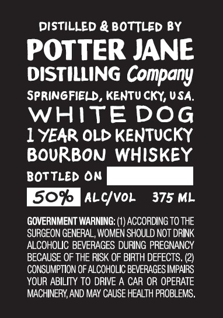

# TTB COLA Label Images - TTBID 26210001000165

**Brand Name:** POTTER JANE DISTILLING COMPANY

**Fanciful Name:** WHITE DOG

**Issue Date:** 08/07/2026

**Origin Code:** 22

**Product Class/Type:** 141

**Source:** [TTB Public COLA Registry](https://ttbonline.gov/colasonline/viewColaDetails.do?action=publicFormDisplay&ttbid=26210001000165)

## Label Images

### Label 1

### Label 2

### Label 3

## Extracted Label Text

*Text extracted via OCR - may contain errors*

*2 image(s) excluded: text did not meet readability threshold*

**Detected Proof:** 100

### Label 1

Distilled & BotTLeD By
POTTER JANE
DISTILLING Company
springfield , KeNtu CKY, USA:
WHITEDOG
1 YEAR OLD KENTUCKY
BOURBON Whiskey
bottLed On
50%
Alcvol
375 ML
GOVERNMENT WARNING: (1) ACCORDING TO THE
SURGEON GENERAL, WOMEN SHOULD NOT dRINK
ALCOHOLIC BEVERAGES DURING PREGNANCY
BECAUSE OF THE RISK OF BIRTH DEFECTS.
ConSuMPTION OF ALCoHOLIC BEVERAGES IMPAIRS
YOUR ABILITY TO DRIVE A CAR OR OPERATE
MACHINERY, AND MAY CAUSE HEALTH PROBLEMS.
