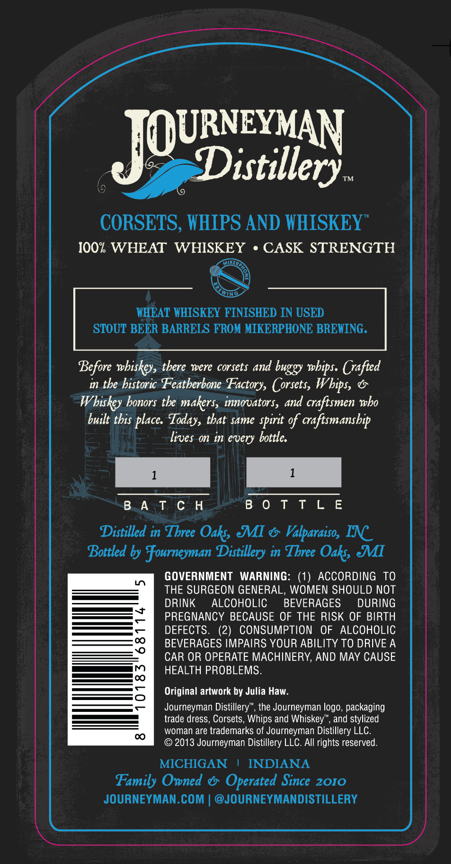
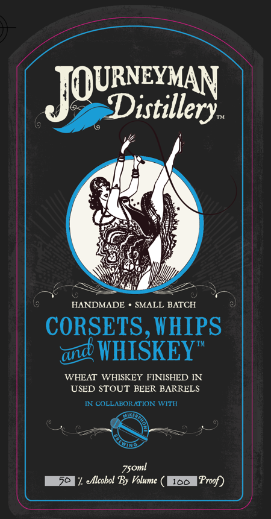

# TTB COLA Label Images - TTBID 26210001000191

**Brand Name:** JOURNEYMAN DISTILLERY

**Fanciful Name:** CORSETS, WHIPS, AND WHISKEY
WHEAT WHISKEY FINISHED IN USED STOUT BEER BARRELS

**Issue Date:** 08/05/2026

**Origin Code:** 06

**Product Class/Type:** 140

**Source:** [TTB Public COLA Registry](https://ttbonline.gov/colasonline/viewColaDetails.do?action=publicFormDisplay&ttbid=26210001000191)

## Label Images

### Back Label

### Front Label

## Extracted Label Text

*Text extracted via OCR - may contain errors*

**Detected Proof:** 100

### Back Label

JOUisxitey
CORSETS, HHIPS AND HHISKEY"
100z WHEAT WHISKEY
CASK STRENGTH
LHEAT WHISKEY FINISHED IN USED
STOUI BEER BARRELS FROM MIKERPHONE BREWING.
Bcfore nbiskey; there #ere corsets and buggy wbips. Crafted
the bistoric Featherbone Factorys Corsets,
bonors tke makers, innowators,
and craftsmen who
built tbis placc:
that Same spirit
craftsmanship
lives o in evcry bottlc:
8 4 T C H
B 0 T T L E
Ditilled in Tbree
MI & Valparaiso, INC
Bottled by Fourneyman Distillery in Tbree
MMI
GOVERNMENT
WARNING:
ACCORDING
THE SURGEON GENERAL; WOMEN SHOULD NOT
DRINK
AlcOHOLIC
BEVERAGES
durIng
PREGNANCY BECAUSE OF THE RISK OF BIRTH
DEFECTS.
(21 CONSUMPTION OF
ALCOHOLIC
BEVERAGES IMPAIRS YOUR ABILITY TO DRIVE
CAR OR OPERATE MACHINERY; AND MAY CAUSE
HEALTH PROBLEMS-
Original artwork by Julia Haw.
Jqumenmnan
Distillary , the Journeyman logo  packa ging
Lirde dres;
Whins ad Wchiste
stylied
Enmnan arctrncrnan$
Huam
Distillery LLC.
2013 Journeyman Distillery LLC_ AIl rights reserved_
MICHIGAN
INDIANA
Family Owned &
Operated Since 2010
JouRNEYMAN COM
@JourNEYMANdISTILLERY
Whips,
Wbitoy
Tal,
Oaks
Oaks;
Coizals

### Front Label

JQURxMtey
HANDMADE
SMALL BATCH
CORSETS, VHIPS
WHISKEY"
WHEAT WHISKEY FINISHED IN
USED STOUT BEER BARRELS
IN cOLLABORATION WITI
7soml
dlcobol By Volume
100
Proof)
and
