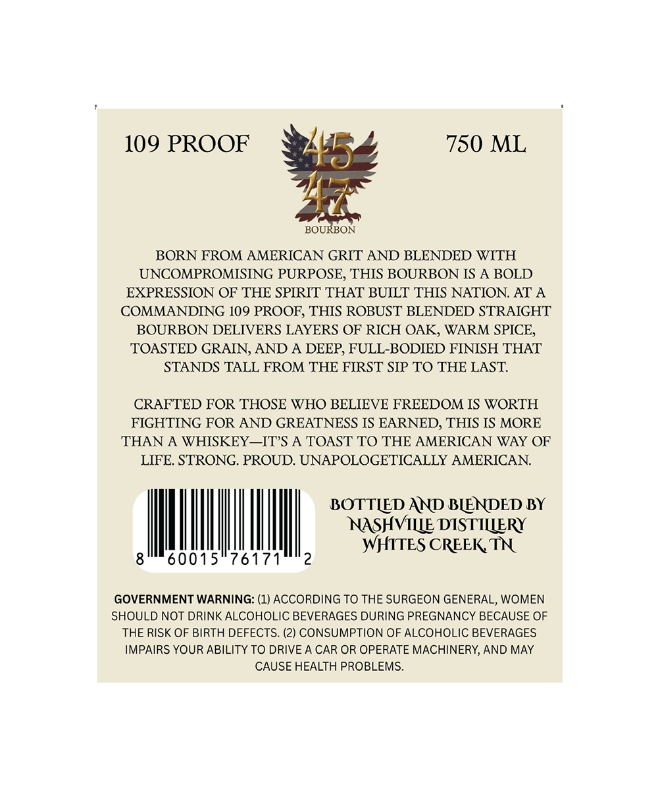
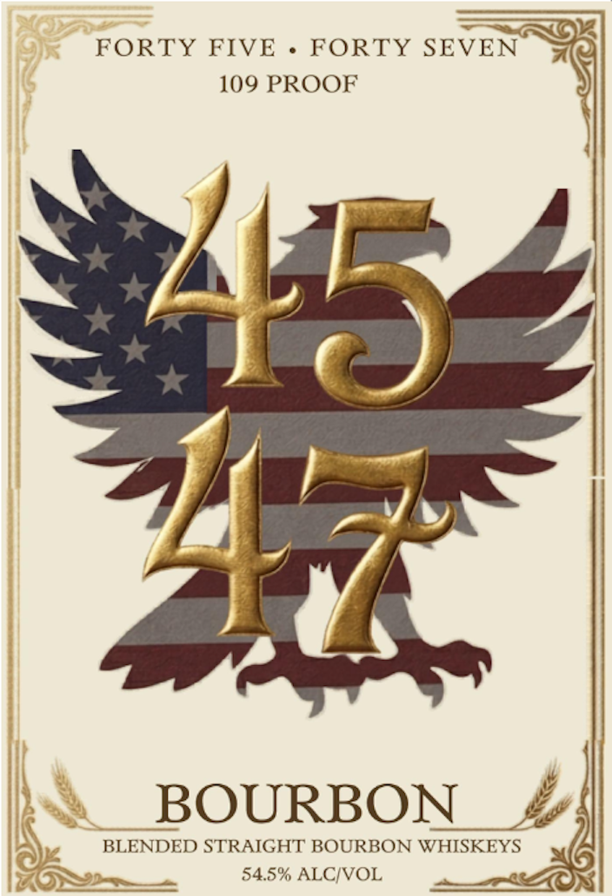

# TTB COLA Label Images - TTBID 26210001000323

**Brand Name:** 4547

**Issue Date:** 08/07/2026

**Origin Code:** 43

**Product Class/Type:** 121

**Source:** [TTB Public COLA Registry](https://ttbonline.gov/colasonline/viewColaDetails.do?action=publicFormDisplay&ttbid=26210001000323)

## Label Images

### Back Label

### Front Label

## Extracted Label Text

*Text extracted via OCR - may contain errors*

**Detected Proof:** 109

### Back Label

109 PROOF 750 ML

BOURBON

BORN FROM AMERICAN GRIT AND BLENDED WITH
UNCOMPROMISING PURPOSE, THIS BOURBON IS A BOLD
EXPRESSION OF THE SPIRIT THAT BUILT THIS NATION. AT A
COMMANDING 109 PROOF, THIS ROBUST BLENDED STRAIGHT
BOURBON DELIVERS LAYERS OF RICH OAK, WARM SPICE,
TOASTED GRAIN, AND A DEEP, FULL-BODIED FINISH THAT
STANDS TALL FROM THE FIRST SIP TO THE LAST.

CRAFTED FOR THOSE WHO BELIEVE FREEDOM IS WORTH
FIGHTING FOR AND GREATNESS IS EARNED, THIS IS MORE
THAN A WHISKEY—IT’S A TOAST TO THE AMERICAN WAY OF
LIFE. STRONG. PROUD. UNAPOLOGETICALLY AMERICAN.

BOTTLED AND BLENDED BY
NASHVILLE DISTILLERY

| | LITES CREEK
8°" 60015°76171" 2 wit REET

GOVERNMENT WARNING: (1) ACCORDING TO THE SURGEON GENERAL, WOMEN
SHOULD NOT DRINK ALCOHOLIC BEVERAGES DURING PREGNANCY BECAUSE OF
THE RISK OF BIRTH DEFECTS. (2) CONSUMPTION OF ALCOHOLIC BEVERAGES
IMPAIRS YOUR ABILITY TO DRIVE A CAR OR OPERATE MACHINERY, AND MAY
CAUSE HEALTH PROBLEMS.

### Front Label

FORTY FIVE
FORTY SEVEN
109 PROOF
47
BOURBON
BLENDED STRAIGHT BOURBON WHISKEYS
54.5% ALCIVOL
45
