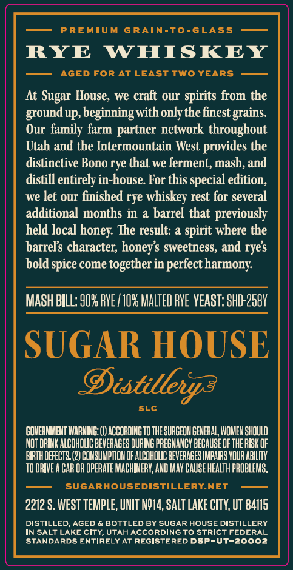
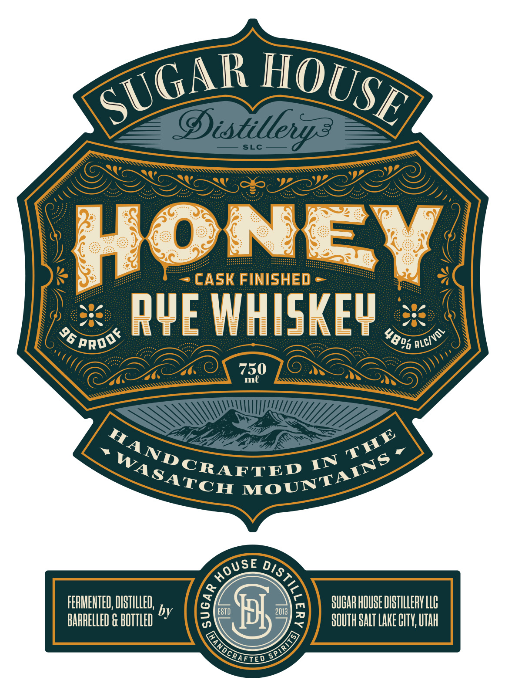
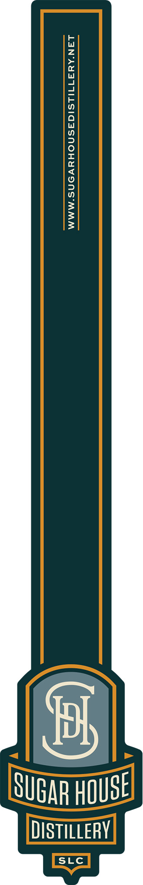

# TTB COLA Label Images - TTBID 26210001000324

**Brand Name:** SUGAR HOUSE DISTILLERY

**Issue Date:** 08/18/2026

**Origin Code:** 45

**Product Class/Type:** 142

**Source:** [TTB Public COLA Registry](https://ttbonline.gov/colasonline/viewColaDetails.do?action=publicFormDisplay&ttbid=26210001000324)

## Label Images

### Back Label

### Front Label

### Label 2

## Extracted Label Text

*Text extracted via OCR - may contain errors*

*1 image(s) excluded: text did not meet readability threshold*

### Back Label

PREMIUM
GRAIN-To-GLASS
RYE
WHISKEY
AGED FoR AT LEAST Two YEARS
At
House; we craft our spirits from the
groundup, beginningwith only the finest grains.
Our family farm partner network throughout
Utah and the Intermountain West provides the
distinctive Bono rye that we ferment, mash, and
distill entirely in-house. For this special edition,
we let our finished rye whiskey rest for several
additional months in a barrel that previously
held local
result: a spirit where the
barrels character; honeys sweetness, and
bold spice come together in
harmony
MASH BILL: 90% PVE / 10% MALTED pvE vEAST: SHD-258V
SUGAR HOUSE
Distillerya
SLc
GOVERHMEHT WARHING:
ACCORDING TO THE SURGEON GENERAL WOMEH shOULD
NOT DRINK ALCOHOLIC BEVERAGES DURING PRECNANCY BECAUSE OF ThE RIsk OF
BIRTH DEFECTS (2) CONSUMPTION OF ALCOHOLIC BEVERAGES IMPARS VOUR ABILIV
TO DRIVE
CAR OR OPERATe MACHINERY; AND MaV CAUSE HEaLTh PROBLEMS,
SUGARHOUSEdiSTILLERY.NET
2212 S. WEST TEMPLE, UNIT NQ14, SALT LAKE CITY,UT 84115
DISTILLED
AGED
BOTTLED BY SUGAR HOUSE DISTILLERY
IN SALT LAKE CIty, UTAH ACCORDINGTo Strict FEDERAL
STANDARDS ENTIRELY AT REGISTERED DSP-Ut-20002
Sugar
honey:
The
ryes
perfect )

### Front Label

@istillenpz?
SLc
ON
CASK FINISHED
RQE WhISkev
750
ml
FERIENTED, DISTILLED;
SUGAR HOUBE DISTILLERY LLC
by
ESTD
2013
BARRELLED & BOTTLED
3
SOUTH SALT Lake HITV, UTah
SUGAR
HOUSE
96 "
Rroof
ALC/VDL
4800 $
THE
"ANDCRAFTED
MOUNTAINS
WASATCH
IN
HoUSe
)
3
SPIR4IS)
Lanochnieo
