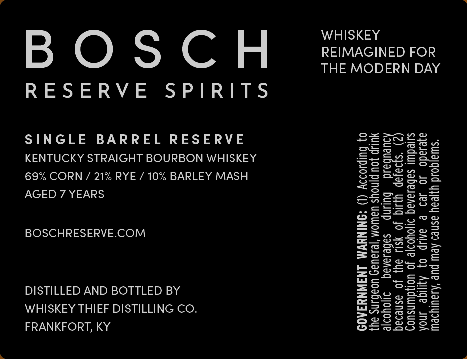
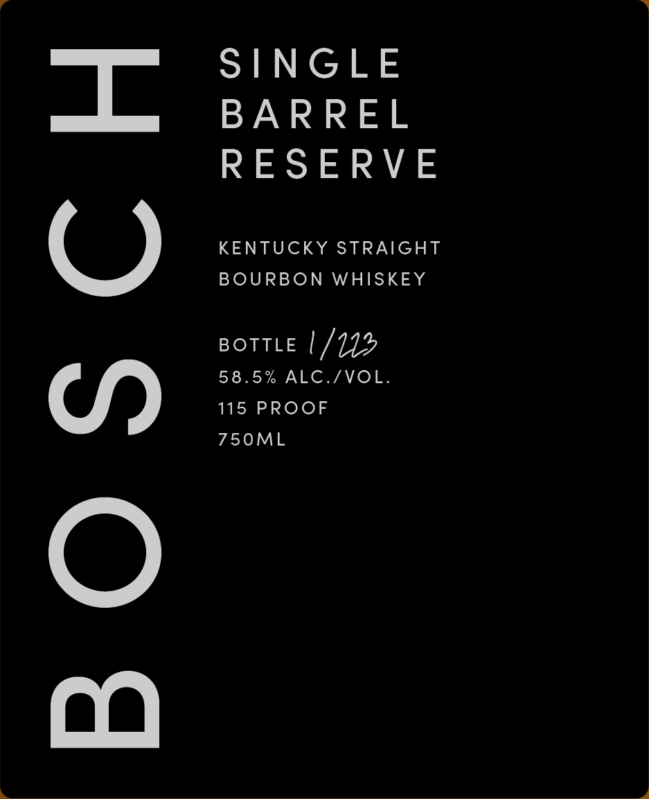

# TTB COLA Label Images - TTBID 26210001000406

**Brand Name:** BOSCH

**Fanciful Name:** SINGLE BARREL RESERVE

**Issue Date:** 08/11/2026

**Origin Code:** 22

**Product Class/Type:** 101

**Source:** [TTB Public COLA Registry](https://ttbonline.gov/colasonline/viewColaDetails.do?action=publicFormDisplay&ttbid=26210001000406)

## Label Images

### Back Label

### Front Label

## Extracted Label Text

*Text extracted via OCR - may contain errors*

**Detected Proof:** 117
**Detected Age:** 7 Years

### Back Label

REIMAGINED FOR
THE MODERN DAY

WHISKEY

BOSCH

RESERVE SPIRITS

“swajqoud yjjeay asneo Aew pue ‘Asaulyoew
ayeiado 40 Jed © AAP 0} Ayjige JNOA
siiedu| sabesanag 21j0Yor|e Jo uoljdwnsuoy
4) 9339 YIG JO S11 ay} Jo asneoaq
Queupaid bulinp safesanaq —1J0Yyor|e
YULIP JOU pjnoys UaWoM ‘JeJaua9 Uoabins au}
0} Bulpioaoy (1) “ONINEWM LNSWNY3A09

KENTUCKY STRAIGHT BOURBON WHISKEY
69% CORN / 21% RYE / 10% BARLEY MASH

SINGLE BARREL RESERVE
AGED 7 YEARS

WHISKEY THIEF DISTILLING CO.

DISTILLED AND BOTTLED BY
FRANKFORT, KY

BOSCHRESERVE.COM

### Front Label

BOSCH

SINGLE
BARREL
RESERVE

KENTUCKY STRAIGHT
BOURBON WHISKEY

Botte | /1J%
58.5% ALC./VOL.
115 PROOF
750ML
