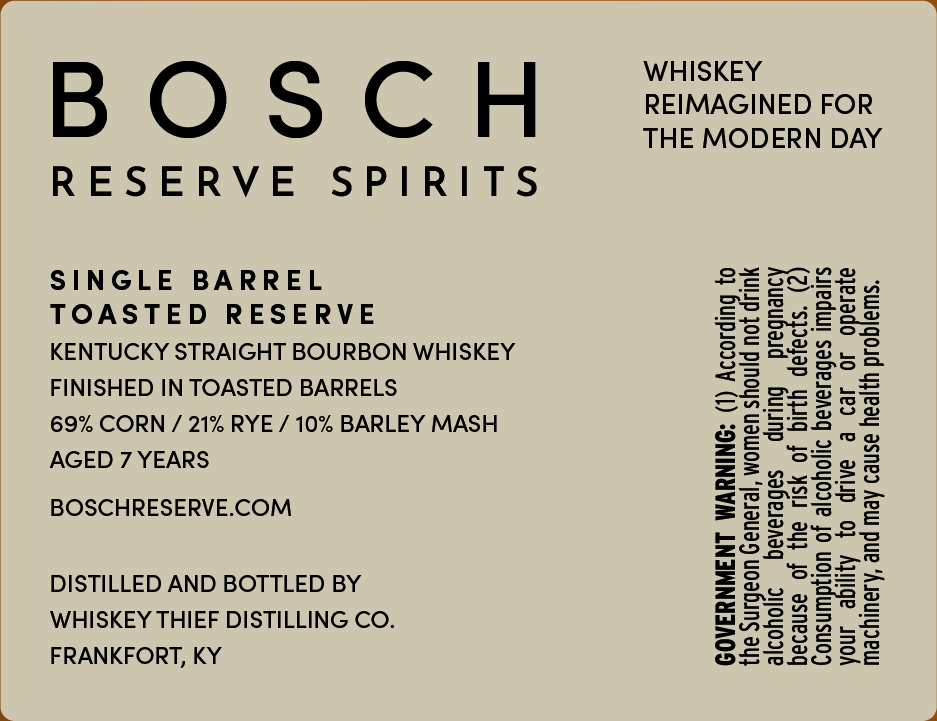
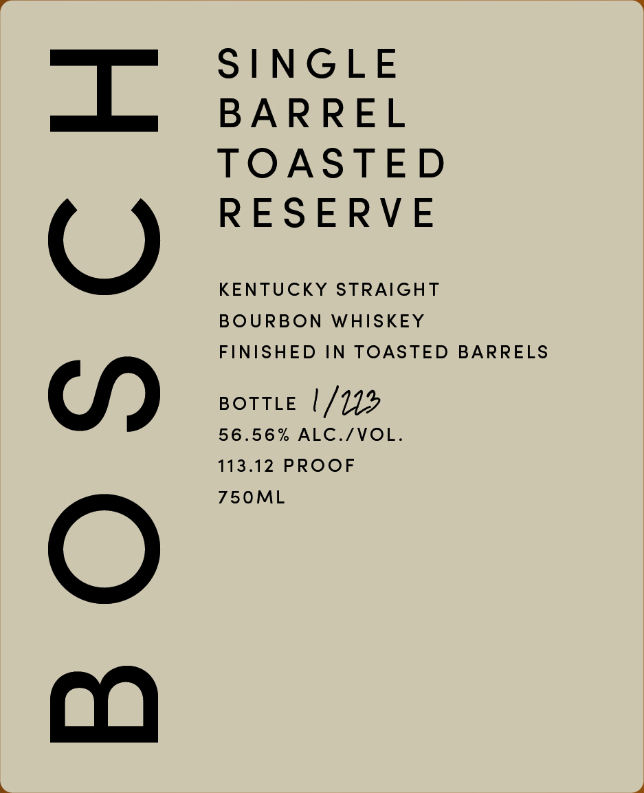

# TTB COLA Label Images - TTBID 26210001000410

**Brand Name:** BOSCH

**Fanciful Name:** TOASTED

**Issue Date:** 08/07/2026

**Origin Code:** 22

**Product Class/Type:** 101

**Source:** [TTB Public COLA Registry](https://ttbonline.gov/colasonline/viewColaDetails.do?action=publicFormDisplay&ttbid=26210001000410)

## Label Images

### Back Label

### Front Label

## Extracted Label Text

*Text extracted via OCR - may contain errors*

**Detected Proof:** 113.1
**Detected Age:** 7 Years

### Back Label

SINGLE BARREL

TOASTED RESERVE

KENTUCKY STRAIGHT BOURBON WHISKEY
FINISHED IN TOASTED BARRELS

69% CORN / 21% RYE / 10% BARLEY MASH
AGED 7 YEARS

BOSCHRESERVE.COM

DISTILLED AND BOTTLED BY
WHISKEY THIEF DISTILLING CO.
FRANKFORT, KY

WHISKEY
REIMAGINED FOR
THE MODERN DAY

ig to
erate

eon General, women should not drink
lems.

ke

or oO

beverages during pregnancy
to drive a car

because of the risk of birth defects. (2

Consum

n of alcoholic beverages impairs

y

fi

9

alcoholic
hinery, and may cause health prob!

GOVERNMENT WARNING; (1) Accordin

the Sur
your a
Mac

### Front Label

BOSCH

SINGLE
BARREL
TOASTED
RESERVE

KENTUCKY STRAIGHT
BOURBON WHISKEY
FINISHED IN TOASTED BARRELS

BOTTLE |/1L2
56.56% ALC./VOL.
113.12 PROOF
750ML
