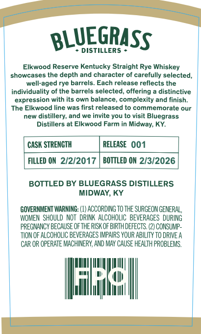
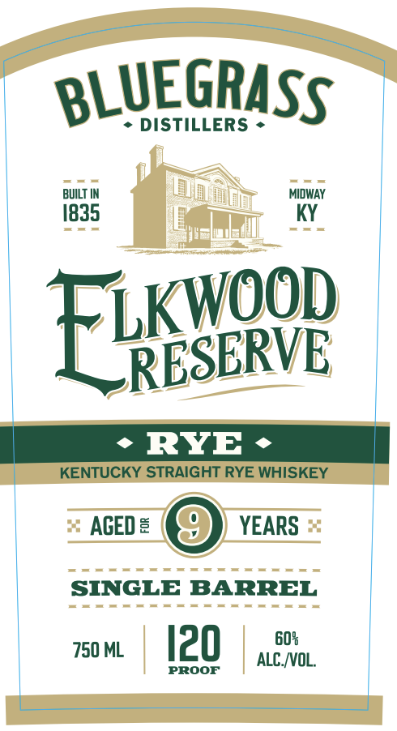
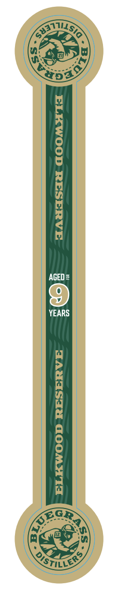

# TTB COLA Label Images - TTBID 26210001000450

**Brand Name:** ELKWOOD RESERVE

**Issue Date:** 08/07/2026

**Origin Code:** 22

**Product Class/Type:** 102

**Source:** [TTB Public COLA Registry](https://ttbonline.gov/colasonline/viewColaDetails.do?action=publicFormDisplay&ttbid=26210001000450)

## Label Images

### Back Label

### Front Label

### Label 2

## Extracted Label Text

*Text extracted via OCR - may contain errors*

*1 image(s) excluded: text did not meet readability threshold*

### Back Label

BLUEGRASS
DISTILLERS
Elkwood Reserve Kentucky Straight Rye Whiskey
showcases the depth and character of carefully selected,
well-aged rye barrels: Each release reflects the
individuality of the barrels selected, offering
distinctive
expression with its own balance,
complexity and finish:
The Elkwood line was first released to commemorate
our
new
distillery, and we invite you to visit Bluegrass
Distillers at Elkwood Farm in Midway; KY:
CaSK STRENGTH
RELEASE  001
FILLED ON 2/2/2017
BOTTLED ON 2/3/2026
BOTTLED BY BLUEGRASS DISTILLERS
MIDWAY, KY
GOVERNMENT WARNING:
ACCORDING TO THE SURGEON GENERAL
WOMEN  SHOULD  NOT   DRINK  AlCoHOLIC   BEVERAGES  DURING
PREGNANCY BeCauSE Ofthe RISK OF BIRTH deFECTS: (2) CONSUMP-
TION OF ALCOHOLIC BEVERAGES IMPAIRS YOUR ABILITY To DRIVE A
CAR OR OPERATE MACHINERY, AND MAY CAUSE HEALTH PROBLEMS.
Ifas

### Front Label

BLUEGRASS
DISTILLERS
BUILT
MIDWAY
1835
KY
Elesoor
RYE
KENTUCKY STRAIGHT RYE WHISKEY
AGED =
YEARS
SINGLE BARREL
750 ML
I20
608
ALC [OL.
PROOF
