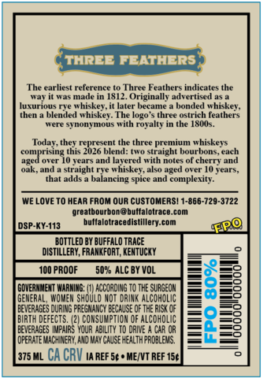
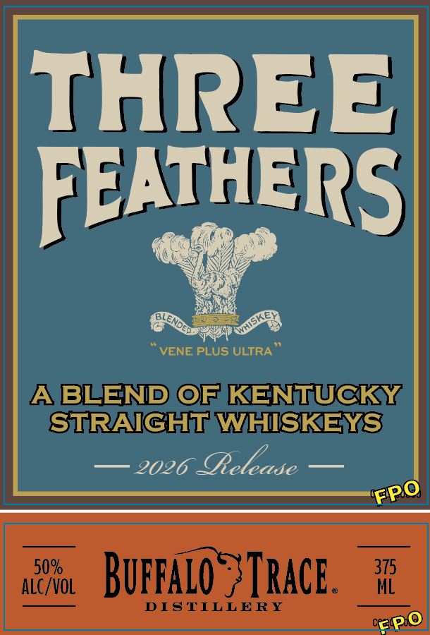
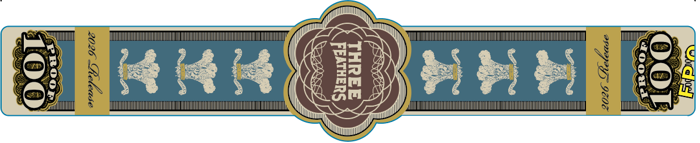

# TTB COLA Label Images - TTBID 26210001000532

**Brand Name:** THREE FEATHERS

**Issue Date:** 08/06/2026

**Origin Code:** 22

**Product Class/Type:** 120

**Source:** [TTB Public COLA Registry](https://ttbonline.gov/colasonline/viewColaDetails.do?action=publicFormDisplay&ttbid=26210001000532)

## Label Images

### Back Label

### Front Label

### Label 3

## Extracted Label Text

*Text extracted via OCR - may contain errors*

*1 image(s) excluded: text did not meet readability threshold*

**Detected Proof:** 100
**Detected Age:** 10 Years

### Back Label

THREE FEATHERS
The earliest reference
Three Feathers indicates the
W4Y ma(C
1812. Originally advertised
luxurious rve
#hiskey it later became
bonded whiskey;
Ten
blended whiskey. The
three ostrich feathers
WCr
stnOn"OU
with royalty in the IS0Us.
Todlay, they represent the three premium whiskeys
comprising this 2026 blend: two straight bourbons; cach
aged over [0 vears and layered with notes
cherry and
Owh.ut
straight rye whiskeg, also #ged over 10 years;
balancing spice -
complexity:
WE LOvE T0 HEAR FROM OUR CUSTOMERSI 1-866-729.3722
grealbourbongbulfalolrace com
DSP-KK-113
buflalotrace distillery com
FP
bottled By BUFFALO TRACE
DISTILLERY, FRANKFORT, KENTUCKy
100 PROOF
5092 ALC BY VOL
GOVERMMEMT=
RNING:
acciading 10 ThE SURGEOH
8
?
GENERal, WMen Should Mot drink alcoholIC
beVeRASES DURING PREGMANCY EechuSE QF the RISK €F
8
BIRTH defects. (2| CONSUMPTIOM OF alcoholIc
8
beverAGES IMPAIRS VOUR ABilITY IO drIE
CaR OR
operaie WAC HUERY, A4D MaY CNSE HEALTHpRObLEMS,
375 ML
CA CRU IA REF 5c * MEIVT REF 154
lopo
ulds

### Front Label

THREE
FEATHERS
VENE PLUS ULTRA
ABLEND @FKENTUCKY
STRAIGHT WHISKEYS
2026 elease
aloNol
Buppaio
Trace .
315
DISTILLERY
CC pl
GLENDe
FPO
