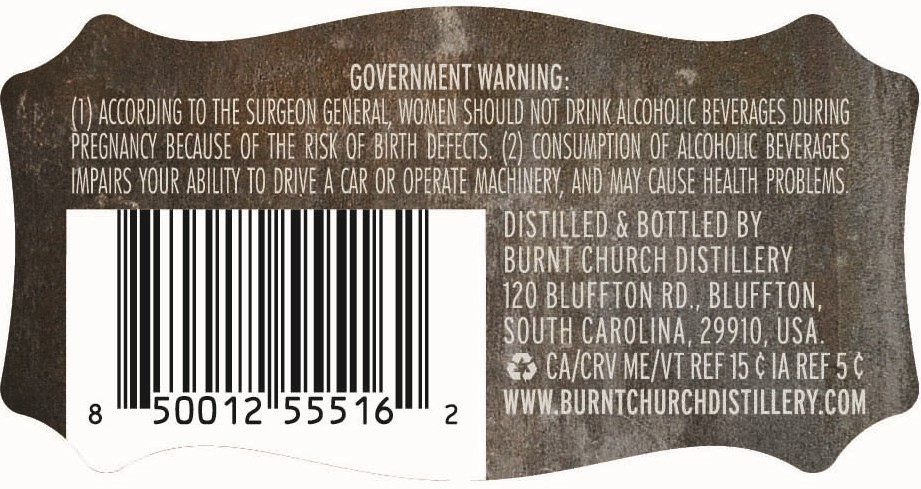
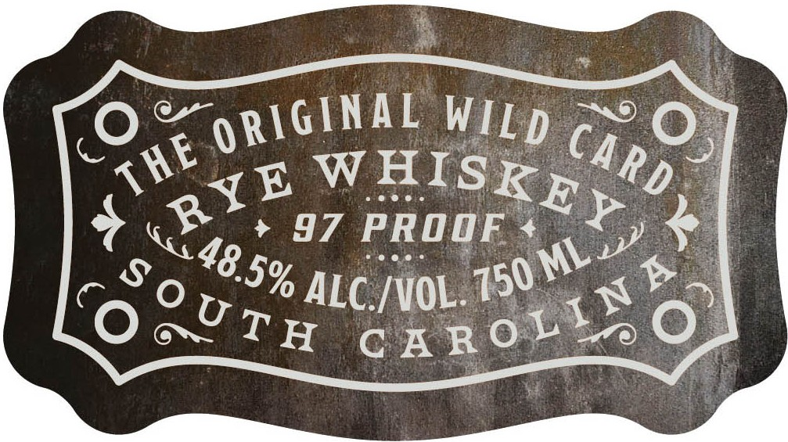

# TTB COLA Label Images - TTBID 26210001000605

**Brand Name:** PALMER'S STRETCH

**Fanciful Name:** THE ORIGINAL WILD CARD

**Issue Date:** 08/05/2026

**Origin Code:** 41

**Product Class/Type:** 142

**Source:** [TTB Public COLA Registry](https://ttbonline.gov/colasonline/viewColaDetails.do?action=publicFormDisplay&ttbid=26210001000605)

## Label Images

### Back Label

### Front Label

## Extracted Label Text

*Text extracted via OCR - may contain errors*

**Detected Proof:** 97

### Back Label

GOVERNMENT WARNING:

(}) ACCORDING TO THE SURGEON GENERAL WOMEN SHOULD NOT DRINK AICOHOUC BEVERAGES DURING
PREGNANCY BECAUSE OFTHE RISK OF BIRTH DEFECTS. 2} CONSUMBTION OF ALCOROWC BEVERAGES
IMPAIRS YOUR ABILITY 70 DRIVE A CAR OR OPERATE ACHIERY, AND WAY CAUSE HERIT PROBLENS
DISTILLED & BOTTLED BY

BURNT CHURCH DISTILLERY

120 BLUFFTON RD., BLUFFTON,
SOUTH CAROLINA, 29910, USA.
> CAVCRV ME/VT REF 15 CIA REF 5 ¢
Mae k PLS AK CLIP Me l/l. BURNTCHURCHDISTILLERY.COM

### Front Label

~ciWal WiLp

Caet i)

E WHISK,

sees

oot

+ 97 PROOF + oA,

eee id

5% ALC /WOL. 1.

xo

H CARO se
