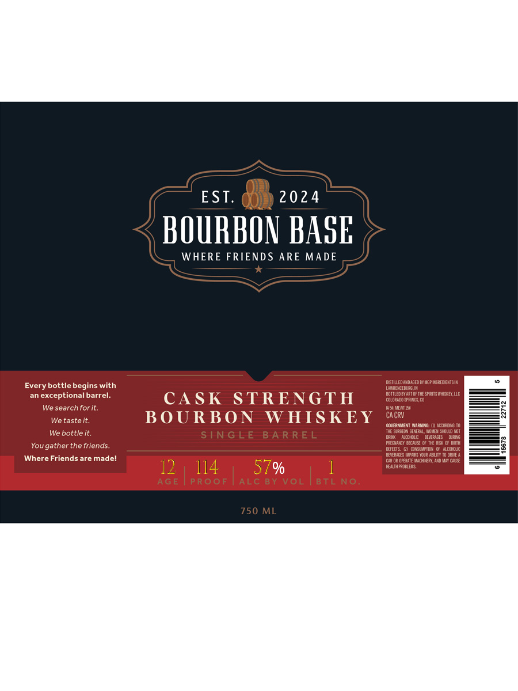

# TTB COLA Label Images - TTBID 26210001000633

**Brand Name:** BOURBON BASE

**Fanciful Name:** BOURBON BASE CASK STRENGTH BOURBON WHISKEY

**Issue Date:** 08/05/2026

**Origin Code:** 13

**Product Class/Type:** 141

**Source:** [TTB Public COLA Registry](https://ttbonline.gov/colasonline/viewColaDetails.do?action=publicFormDisplay&ttbid=26210001000633)

## Label Images

### Label 1

## Extracted Label Text

*Text extracted via OCR - may contain errors*

**Detected Proof:** 114

### Label 1

EST.
2024
BOURBON BASE
WHERE FRIENDS ARE MADE
vistillevauagedbi Ugp [erloabIl
Every bottle begins with
Wamre" LiBLE In
exceptional barrel:
CASK
STRENGTH
cotored)sprCoF ,0e sfrnsmhstey UlC
We search for it.
VEMES
We taste it:
BOU RBO N
W HISKEY
CA CRV
culerneNI Marniss
alcurcns I0
ke SeningeePaMueeHUMt
We bottle it.
STNG LE
BA R RE L
e
El a
mrit
PENE a
BC
Hmpa
You
gather the friends.
deFEcts
Dinstnaln
lohul
E
BEVtpebis IcutscRae LItt tv rue a
Where Friends are madel
Cr OR OFfIcaie MMcHNRI  And May04*
12
114
57%
HLtMFROEE
AGE
P ROoF
ALC BY VoL
BTL No;
750 ML
