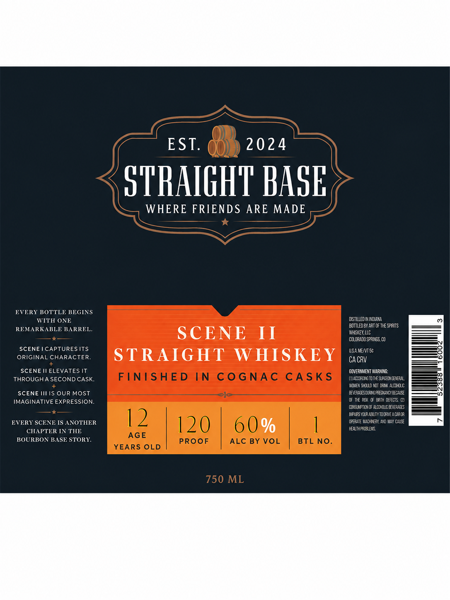

# TTB COLA Label Images - TTBID 26210001000639

**Brand Name:** STRAIGHT BASE

**Fanciful Name:** FINISHED SERIES

**Issue Date:** 08/28/2026

**Origin Code:** 13

**Product Class/Type:** 100

**Source:** [TTB Public COLA Registry](https://ttbonline.gov/colasonline/viewColaDetails.do?action=publicFormDisplay&ttbid=26210001000639)

## Label Images

### Label 1

## Extracted Label Text

*Text extracted via OCR - may contain errors*

### Label 1

EST.
2024
STHAIGHT HAGE
WHERE FRIENDS ARE MADE
EVERY BOTTLE BEGINS
WITH ONE
DSTLLEd MM DLaa
BoTTLeO BY ART OF The SPIAITS
REMARKABLE BARREL.
SCENE
II
WHGKEY llC
colgradOSPFINSS CO
SCENE ICAPTURES ITS
USA MEN50
ORIGINAL CHARACTER.
STRAIGHT
WHISKEY
CA CRV
SCENE Il ELEVATES IT
GOVERHNIEHT WARHING
THROUGHA SECOND CASK
FINISHED IN
CoGNAC
CASKS
(uAc leLu GTotE Sipceonceta"
3
Woneh 9-clo NI 03IK AllholCc
SCENE IS OUR MOST
BITUCESDMGPREUNULYECIR
IMAGINATIVE EXPRESSION:
0 I RS @ Bamh [Otlis @)
Cjin PtOnm Alonulceears
Npaas Yilaabuiy tocAnEaciagr
EVERY SCENE IS ANOTHER
12
120
6 0 %
(FBaie VudIIX ANd MAY CIX
CHAPTER IN THE
HjltheEES
AGE
BOURBON BASE STORY
PROOF
ALC BY VOL
BTL No.
YEARS OLD
750 ML
