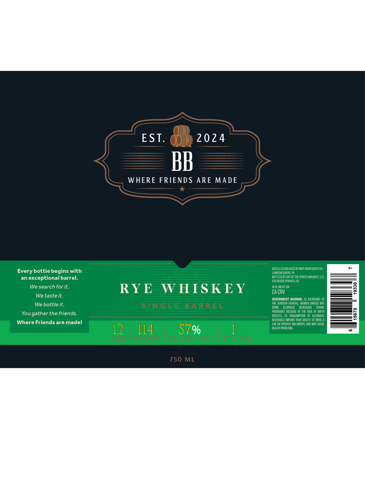

# TTB COLA Label Images - TTBID 26210001000641

**Brand Name:** BB

**Fanciful Name:** RYE WHISKEY

**Issue Date:** 08/05/2026

**Origin Code:** 13

**Product Class/Type:** 142

**Source:** [TTB Public COLA Registry](https://ttbonline.gov/colasonline/viewColaDetails.do?action=publicFormDisplay&ttbid=26210001000641)

## Label Images

### Label 1

## Extracted Label Text

*Text extracted via OCR - may contain errors*

**Detected Proof:** 114

### Label 1

EST.
2024
BB
WHERE FRIENDS ARE MADE
dIstlEdardagedbiugp ierecreysIl
Every bottle begins with
Laren ebleg In
exceptional barrel:
BOTTLED EY APT OF TK SFRITS LHIS V UC
Coloraddspe15,W
We search for it:
RYE
W HS KE Y
HE VEME
8
CACRV
We taste it.
cuternmien WArNINe
alcuiCNG I0
Te 5ortn GeKepreaueeu AMt
We bottle it.
S T NG EE
BAeRREE
e
Eana
W
Yougather the friends.
Phcant Cul E
H Pb
BaTH
8
defecia
Dis_Nptun
Mdhu
BFVEPIEES WELF S ICUR KBLTY TD DRNE A
Where Friends are madel
OP meEATE MccdAum ILX C
12
114
57%
health fpdelels

1

(
750 ML
