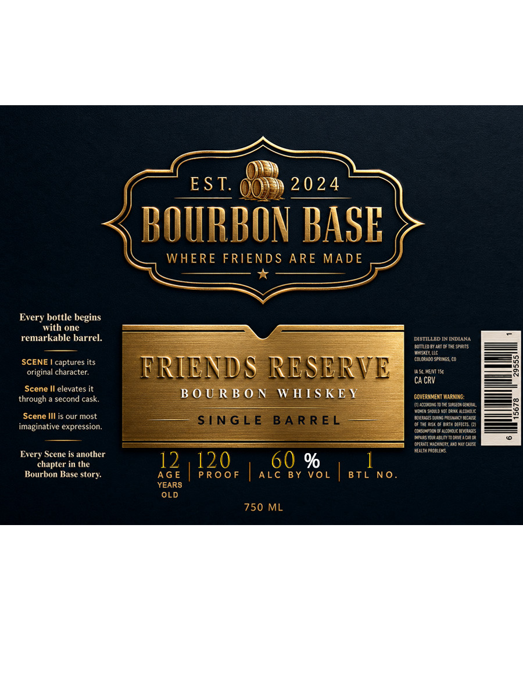

# TTB COLA Label Images - TTBID 26210001000646

**Brand Name:** BOURBON BASE

**Fanciful Name:** FRIENDS RESERVE SINGLE BARREL

**Issue Date:** 08/20/2026

**Origin Code:** 13

**Product Class/Type:** 141

**Source:** [TTB Public COLA Registry](https://ttbonline.gov/colasonline/viewColaDetails.do?action=publicFormDisplay&ttbid=26210001000646)

## Label Images

### Label 1

## Extracted Label Text

*Text extracted via OCR - may contain errors*

**Detected Proof:** 120

### Label 1

EST.
20 2 4
BOURBON BASH
WHERE
FRIENDS ARE
MADE
Every bottle begins
with one
remarkable barrel:
DISTILLED IN INDIANA
~Bonleo UuaetoF IHE Spipits
Ahbueuc
SCENE
captures its
COLORACO $n8g5, (0
original character:
FRIEND S RESERVE
Mc MET I5
CA CRV
Scene Il elevates it
B 0 U RB 0 N
WHTS KEY
through
second cask,
Govermveni Marning:
Mucensonaaa
ene SODei danaalco cln
Scene Ill is our most
SINGL E
B A RR E L
Chaehansennnln tlennt
imaginative expression:
Jof Theit Binth Crfecis @1
CuDi
HDcEs
Maesto LSun Idestatio
feaxte Man LirlamdMace
Health rcaivs
Every Scene is another
chapter in the
12
120
60 %
Bourbon Base story:
AG E
PR0 0 F
ALc BY VoL
B TL No
YEARS
OLD
750 ML
