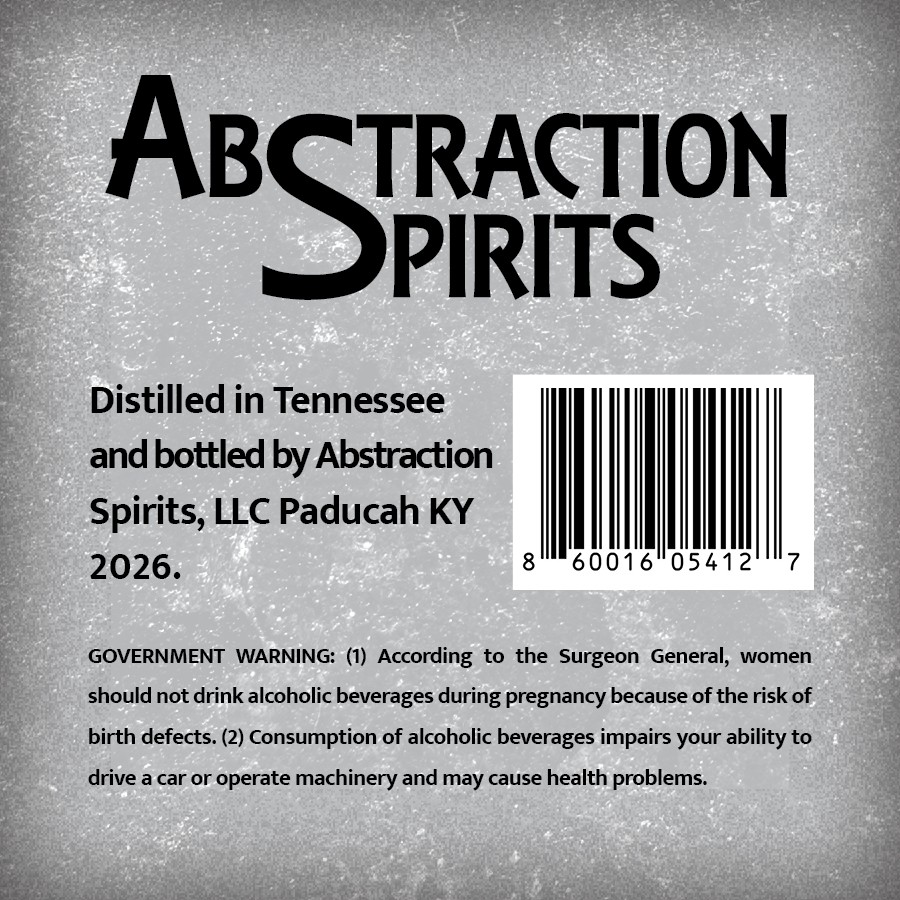
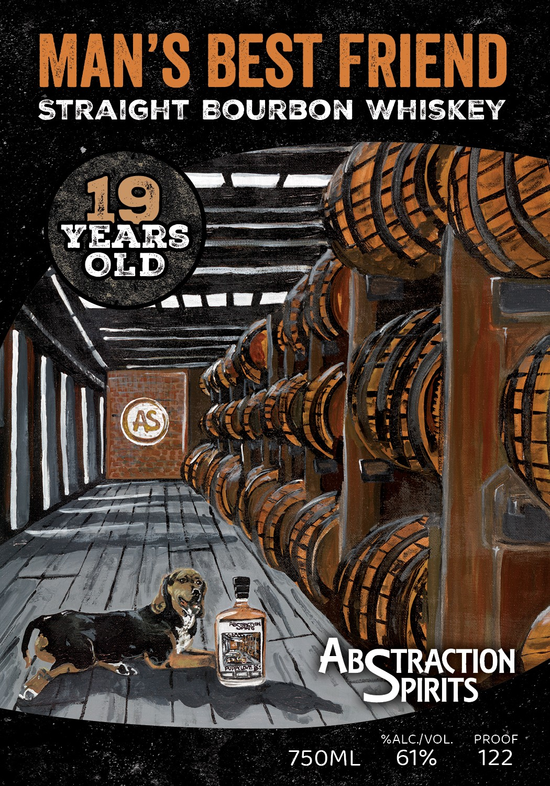

# TTB COLA Label Images - TTBID 26211001000080

**Brand Name:** ABSTRACTION SPIRITS

**Fanciful Name:** MAN'S BEST FRIEND

**Issue Date:** 08/05/2026

**Origin Code:** 22

**Product Class/Type:** 101

**Source:** [TTB Public COLA Registry](https://ttbonline.gov/colasonline/viewColaDetails.do?action=publicFormDisplay&ttbid=26211001000080)

## Label Images

### Back Label

### Label 1

## Extracted Label Text

*Text extracted via OCR - may contain errors*

### Back Label

TRACTION

ABS

PIRITS

Distilled in Tennessee

and bottled by Abstraction

Spirits, LLC Paducah KY

I

0160541

MM

|

.

GOVERNMENT WARNING: (1) According to the Surgeon General, women

should not drink alcoholic beverages during pregnancy because of the risk of

birth defects. (2) Consumption of alcoholic beverages impairs your ability to

drive a car or operate machinery and may cause health problems.

### Label 1

BEA A 1@ TCT CDICENN
WAIN VU DLV NILIND |
_ STRAIGHT BOURBON WHISKEY
Yo ~~ _ aug aie oH hee
Wel
he ee Le
eT NRA
Ui BPS \ . ff A
Ape <A a f BCJRACTION |
LO ~ “SSPIRITS
nae ; ee we ALC IVOL. . PROOF -
Tay Wiggs Jae a TS0ML.~., 61% 4). 122
