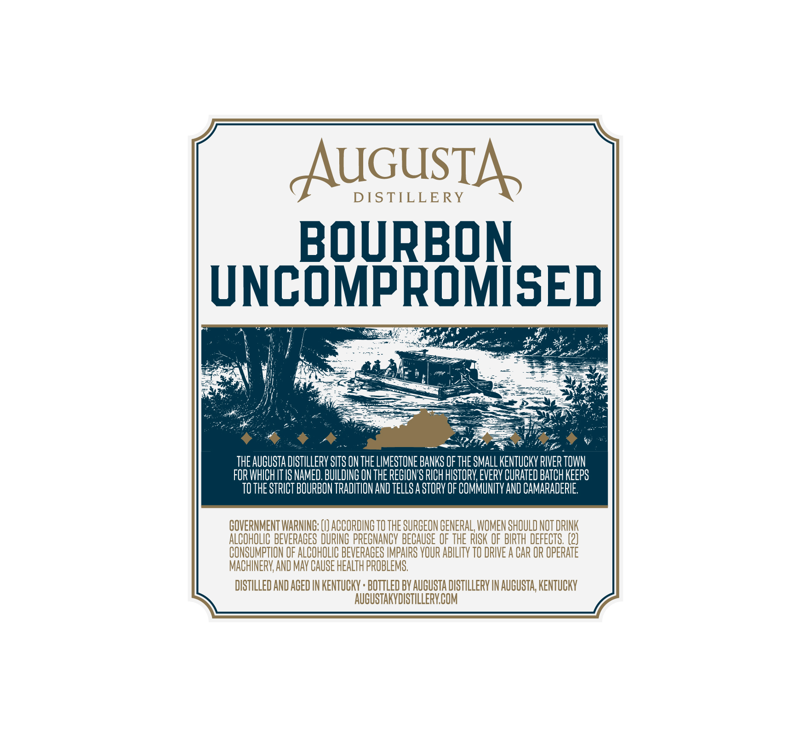
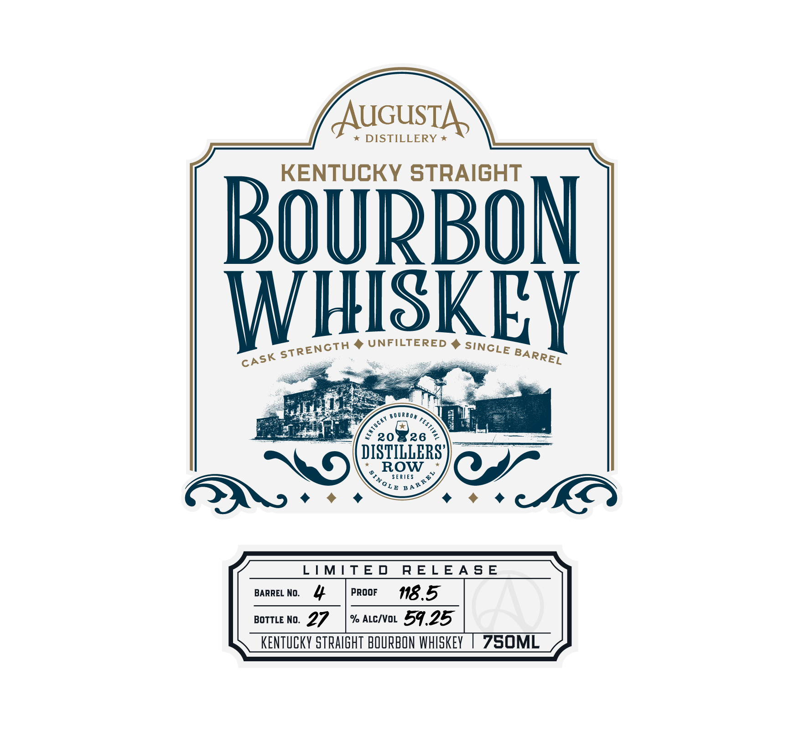

# TTB COLA Label Images - TTBID 26211001000152

**Brand Name:** AUGUSTA DISTILLERY

**Fanciful Name:** DISTILLERS' ROW

**Issue Date:** 08/05/2026

**Origin Code:** 22

**Product Class/Type:** 101

**Source:** [TTB Public COLA Registry](https://ttbonline.gov/colasonline/viewColaDetails.do?action=publicFormDisplay&ttbid=26211001000152)

## Label Images

### Back Label

### Label 1

## Extracted Label Text

*Text extracted via OCR - may contain errors*

**Detected Proof:** 118.5

### Back Label

AUGusTa
DIS TILLE RY
BOuRBON
UNCOMPROMISED
THE AuGuSta DISTILLERV SLTS ON THE LIMESTONE BANKS OF THE SMALL KENTuCKV RIVER TOWN
FOR WHICH IT IS NAMED. BUILDING ON THE REGHON'S RICH HISTORV; EVERV CURATED BATch KEEPS
TO THE STRICT BOURBON TRADITFON AND TELLS A STORY OF COMMUNITV AND CAMARADERIE;
GOVERNMENT WARNINC; (H) ACCORDING TO THE SURGEON GENERAL, WOMEN SHOULD NOT DRINK
ALCOHOLIC BEVERAGES DURING PREGNANCY BECAUSE OF THE RISK OF BIRTH DEFECTS , (2)
CONSUMPTION OF ALCOHOLIC BEVERAGES IMPAIRS VOUR ABILITY TO DRIVE A CAR OR OpERATE
MACHINERV AND MAV CAUSE HEALTH PROBLEMS ,
DISTILLED AND AGED IN KENTUCKV . BOTTLED BV AUGUSTA DISTILLERV IN AUGUSTA, KENTUCKY
AUCUSTAKYDISTILLERY COM

### Label 1

TAuGusTA'
DISTILLERY
KENTUCKY STRAIGHT
BOURBON
WHISKET
UNFILTERED
B0 URBom
20
26
DISTILLERS'
ROW
SE RIES
3
KO
LIMIT E D
R EL EA S E
BARREL No:
PROOF
118.5
BOTTLE No:
27
% ALC/VOL
59.25
KENTuCKY siraIGHT BOURBON WHISKEY
750ML
STRENCTH
SINCLE
BARREL
CASK
0
1
SINGLE
REL
B A
