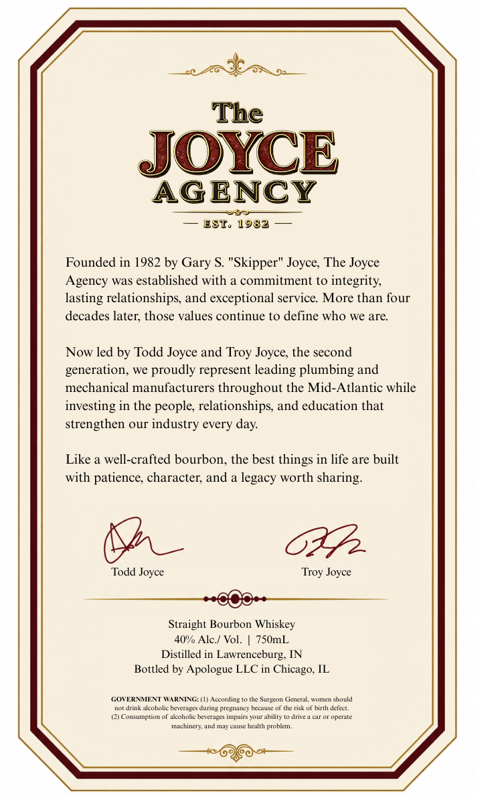
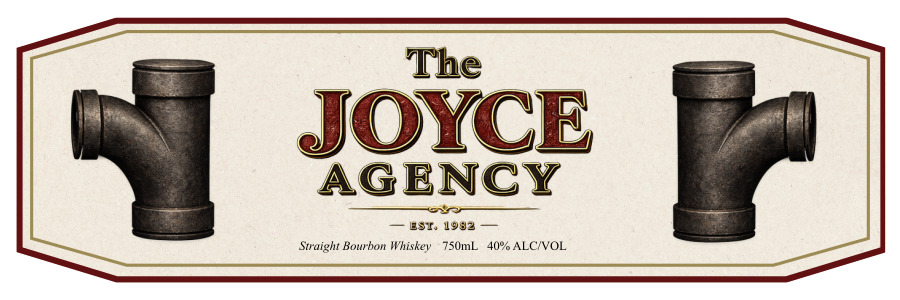

# TTB COLA Label Images - TTBID 26211001000247

**Brand Name:** THE JOYCE AGENCY

**Issue Date:** 08/12/2026

**Origin Code:** 04

**Product Class/Type:** 101

**Source:** [TTB Public COLA Registry](https://ttbonline.gov/colasonline/viewColaDetails.do?action=publicFormDisplay&ttbid=26211001000247)

## Label Images

### Back Label

### Front Label

## Extracted Label Text

*Text extracted via OCR - may contain errors*

### Back Label

The
JOYCE
AGENCY
EST- 1982
Founded in 1982 by Gary $ "Skipper" Joyce; The Joyce
Agency was established with a commitment to integrity
lasting relationships; and exceptional service More than four
decades later; those values continue t0 define who
we are.
Now led by Todd Joyce and Troy Joyce; the second
generation.
wC
proudly represent leading plumbing and
mechanical manufacturers throughout the Mid-Atlantic while
investing in the people; relationships, and education that
strengthen our industry every day
Like a well-crafted bourbon; the best things in life are built
with patience; character; and a legacy worth sharing:
Todd Joyce
Joyce
Straight Bourbon Whiskey
40"/ Alc / Vol_
750mL
Distilled in
Lawrenceburg; IN
Bottled by Apologue LLC in
GOVERNMENT WARNING: (1) According
Lhe SurecOn
Gencral
Woncn aoula
noldrinkalecholic
beverages during pregnancy bccause
thc nsk ofhirh dcltc
CConsumption
acoholic bevcragts impairs your ability
dnvc 1
opcralc
mac hink And nJC
calc hcalth problcm
Troy
Chicago-

### Front Label

The
JOYCE
AGENCY
EST 1932
Straight Bourbon Whiskey
75umL
40" ALCIVOL
