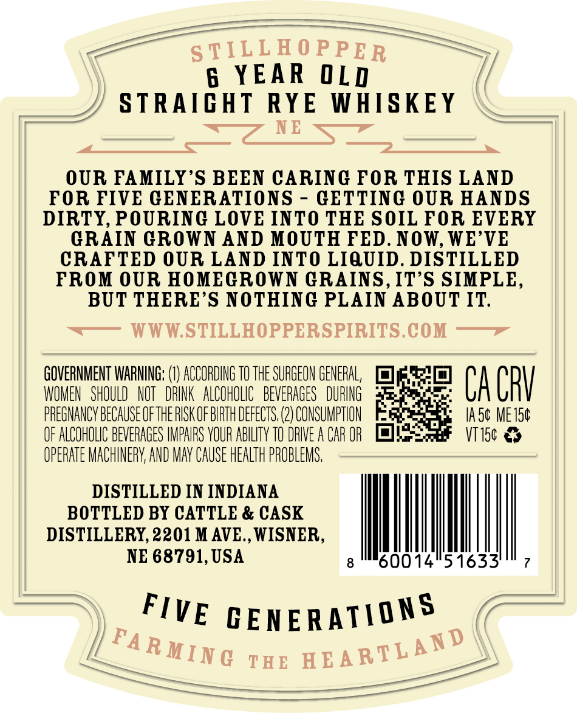
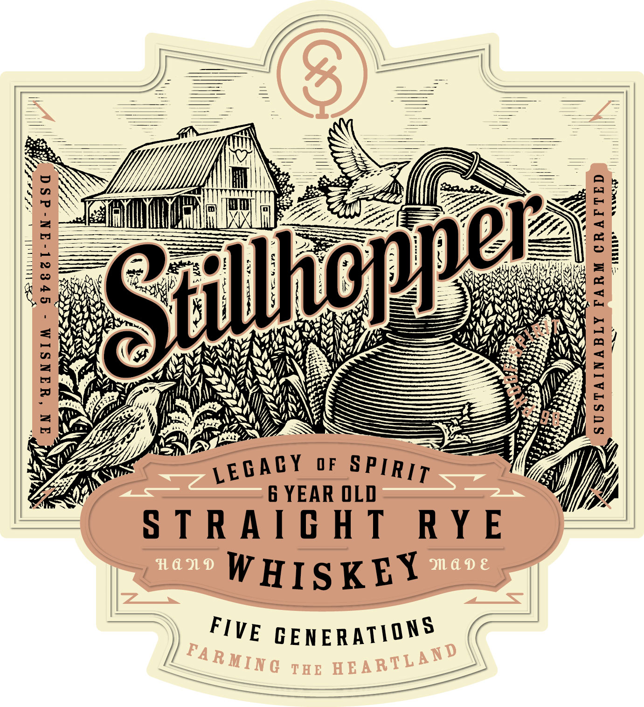
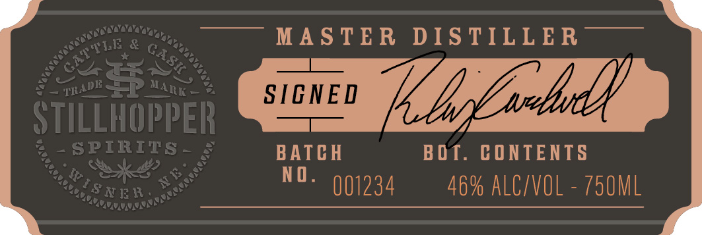
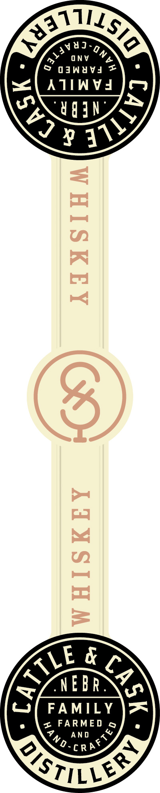

# TTB COLA Label Images - TTBID 26211001000253

**Brand Name:** STILLHOPPER

**Issue Date:** 08/05/2026

**Origin Code:** 31

**Product Class/Type:** 102

**Source:** [TTB Public COLA Registry](https://ttbonline.gov/colasonline/viewColaDetails.do?action=publicFormDisplay&ttbid=26211001000253)

## Label Images

### Back Label

### Front Label

### Label 2

### Label 3

## Extracted Label Text

*Text extracted via OCR - may contain errors*

*1 image(s) excluded: text did not meet readability threshold*

**Detected Proof:** 92
**Detected Age:** 6 Years

### Back Label

S TILLEO PPE R
6  YEAR OLD
STRAIGHT
RYE
WHISKEY
NE
OUR FAMILY'S BEEN CARINC FOR THIS LAND
FOR FIVE GENERATIONS
GETTING OUR HANDS
DIRTY, POURINGC LOVE INTO THE SOIL FOR EVERY
GRAIN GROWN AND MOUTH FED. NOW, WE'VE
CRAFTED OUR LAND INTO LIQUID. DISTILLED
FROM OUR HOMEGROWN GRAINS,IT'S SIMPLE,
BUT THERE'S NOTHING PLAIN ABOUT IT:
WWW.STILLHOPPERSPIRITS.COM
GOVERNMENT WARNING; =
ACCORDING TO THE SURGEON GENERAL;
WOMEN   SHOULD   NOT   DRINK   ALCOHOLIC   BEVERAGES   DURING
CA CRV
PREGNANCY BECAUSEOFTHE RISK OF BIRTH DEFECTS (2) CONSUMPTHON
IA 5c ME 150
OF ALCOHOLIC BEVERAGES IMPAIRS VOUR ABHLITv TO DRIVE A CAR OR
VT 150
OPERATE MACHINERK; AND MAY CAUSE HEALTH PROBLEMS,
DISTILLED IN INDIANA
BOTTLED BY CATTLE & CASK
DISTILLERY,2201 M AVE., WISNER,
NE 68791, USA
60014151633'
CENERATIONS
TEE
FIVE
FA R MIN G
EEARTL A ND

### Label 2

MAS TE R
DIS TILL E R
3
SIGNED
Khsarbd)
STILLHOPPER
SPIRITS
BATCH
B DT . CONTENTS
S N13 18
1
NO _
001234
46% AlC/VOL
750ML
"GATTLE
GASI _
TRADK
MARK '
IV [ =
AAA
'OonnnnnnL
AAAA

### Label 3

43)

Ln?

Sony %

ui

° (/ aganuva =\ ©

ATIWVW4

ANY

23

LE &

FAMILY

eo \s FARMED gf]

AND

crot

STILE
