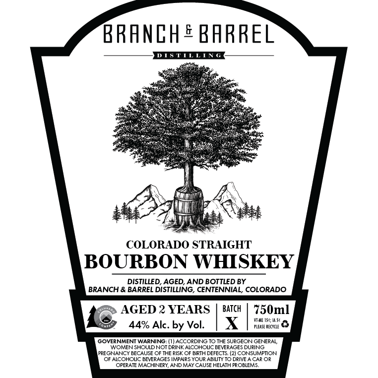

# TTB COLA Label Images - TTBID 26211001000305

**Brand Name:** BRANCH & BARREL

**Issue Date:** 08/12/2026

**Origin Code:** 13

**Product Class/Type:** 101

**Source:** [TTB Public COLA Registry](https://ttbonline.gov/colasonline/viewColaDetails.do?action=publicFormDisplay&ttbid=26211001000305)

## Label Images

### Label 1

## Extracted Label Text

*Text extracted via OCR - may contain errors*

**Detected Proof:** 88
**Detected Age:** 2 Years

### Label 1

EE —_
ee ee
Pete bP aS ee
Pea eringy slates (Ee A
Sn es
Se ae ae Se
Poe ees Ser
eS IRENE ee cpr tr
Sik Gabi emcee le
esas (on ae ass nee ee
SAC ce (Ero cee cee ee
Soon ane eon ati
xe =) pee igre
Lk \
NN fim 4.
aT ON
eee he AYIA ae :
COLORADO STRAIGHT
DISTILLED, AGED, AND BOTTLED BY
BRANCH & BARREL DISTILLING, CENTENNIAL, COLORADO
Os AGED 2 YEARS | BATCH | 750ml
44% Alc. by Vol. | XX | titsuens &
WOMEN SHOULD NOT DRINK ALCONOUC BEVERAGES DUANG
PREGNANCY BECAUSE OF THE RISK OF BIRTH DEFECTS. (2) CONSUMPTION:
(OF AICOHOUC BEVERAGES IMPAIES YOUR ABIUTY TO DEVE A CAR OR
‘GPEPATE MACHINERY AND MAY CAUSE HELATH PROBLEMS,
