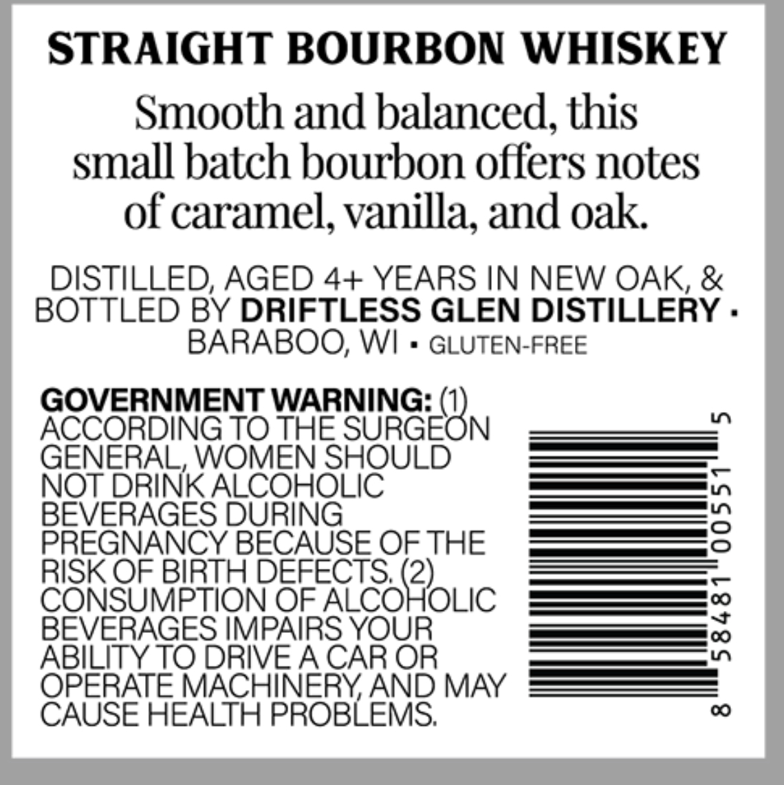
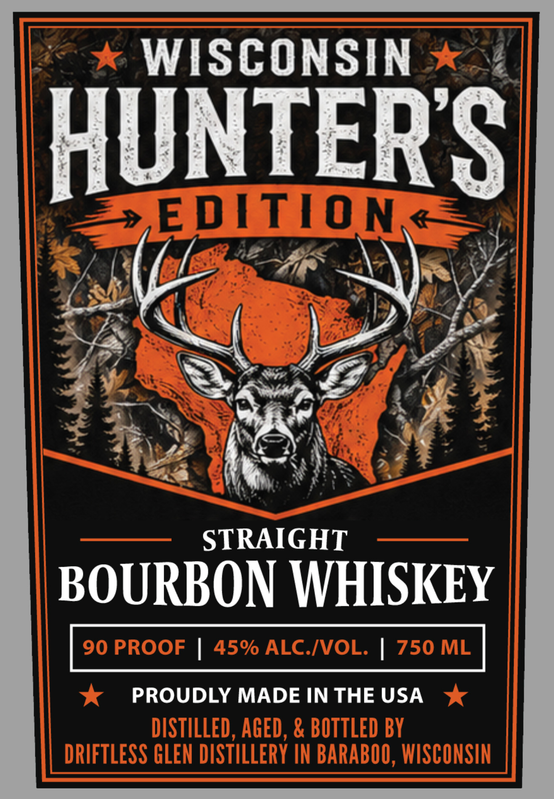

# TTB COLA Label Images - TTBID 26211001000313

**Brand Name:** WISCONSIN HUNTER'S EDITION

**Issue Date:** 08/06/2026

**Origin Code:** 48

**Product Class/Type:** 101

**Source:** [TTB Public COLA Registry](https://ttbonline.gov/colasonline/viewColaDetails.do?action=publicFormDisplay&ttbid=26211001000313)

## Label Images

### Back Label

### Front Label

## Extracted Label Text

*Text extracted via OCR - may contain errors*

**Detected Proof:** 90

### Back Label

STRAIGHT BOURBON WHISKEY
Smooth and balanced,
9
this
small batch bourbon offers notes
of caramel, vanilla; and oak
DISTILLED, AGED 4+ YEARS IN NEW OAK &
BOTTLED BY DRIFTLESS GLEN DISTILLERY .
BARABOO, WI
GLUTEN-FREE
GOVERNMENT WARNING:
L
ACCORDING TO THE SURGEON
GENERAL, WOMEN SHOULD
NOT DRINK ALCOHOLIC
BEVERAGES DURING
3
PREGNANCY BECAUSE OF THE
RISK OF BIRTH DEFECTS (2)
CONSUMPTION OF ALCOHOLIC
BEVERAGES IMPAIRS YOUR
{
ABILITY TO DRIVE A CAR OR
OPERATE MACHINERYAND MAY
CAUSE HEALTH PROBLEMS;
0

### Front Label

WISCONSIN
HUNTERS
EDLTION Z`
STRAIGHT
BOURBON WHISKEY
90 PROOF
45% ALCIVOL:
750 ML
PROUDLY MADE IN THE USA
DISTILLED , AGED , & BOTTLED BY
DRIFTLESS GLEN DISTILLERY IN BARABOO, WISCONSIN
