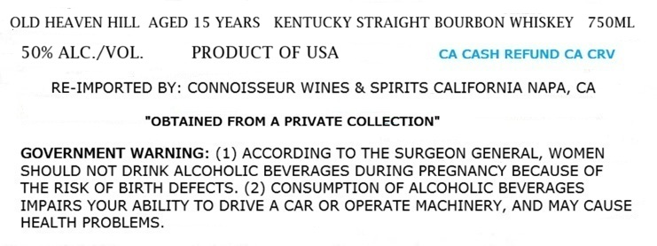
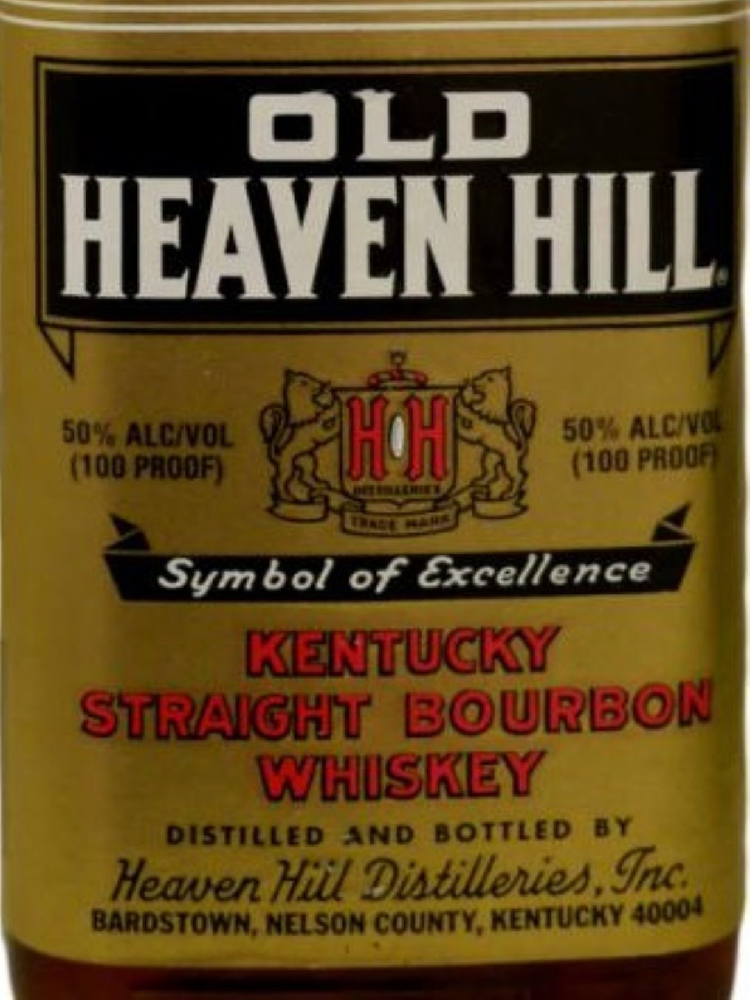

# TTB COLA Label Images - TTBID 26211001000390

**Brand Name:** OLD HEAVEN HILL

**Fanciful Name:** 15 YEARS OLD

**Issue Date:** 08/07/2026

**Origin Code:** 01

**Product Class/Type:** 101

**Source:** [TTB Public COLA Registry](https://ttbonline.gov/colasonline/viewColaDetails.do?action=publicFormDisplay&ttbid=26211001000390)

## Label Images

### Label 1

### Label 2

## Extracted Label Text

*Text extracted via OCR - may contain errors*

**Detected Proof:** 100
**Detected Age:** 15 Years

### Label 1

OLD HEAVEN HILL AGED 15 YEARS
KENTUCKY STRAIGHT BOURBON WHISKEY
75OML
50% ALC /VOL
PRODUCT OF USA
CA CASH REFUND CA CRV
RE-IMPORTED BY: CONNOISSEUR WINES & SPIRITS CALIFORNIA NAPA, CA
"OBTAINED FROM A PRIVATE COLLECTION"
GOVERNMENT WARNING: (1) ACCORDING TO THE SURGEON GENERAL, WOMEN
SHOULD NOT DRINK ALCOHOLIC BEVERAGES DURING PREGNANCY BECAUSE OF
THE RISK OF BIRTH DEFECTS. (2) CONSUMPTION OF ALCOHOLIC BEVERAGES
IMPAIRS YOUR ABILITY TO DRIVE A CAR OR OPERATE MACHINERY, AND MAY CAUSE
HEALTH PROBLEMS

### Label 2

OLD
HEAVEN HILL
509  AllcinOL
IH
50 % AlCiNQ
ld@ paoof
(100 PaOOA
bol of Excellence
KELTUCKY
STRNGHT' BOURBON
WHISKEY
DISTILLED
AND BOTTLED
BT
Heaven Hiil Dixtillenies Inc
Barostown; NELSON CountY; KENTUCHY
Sym
40o0u
