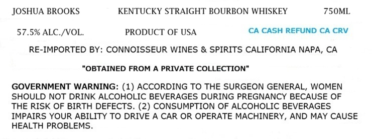
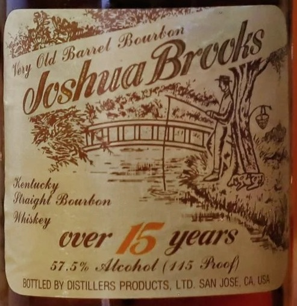

# TTB COLA Label Images - TTBID 26211001000407

**Brand Name:** JOSHUA BROOKS

**Fanciful Name:** 15 YEARS

**Issue Date:** 08/05/2026

**Origin Code:** 01

**Product Class/Type:** 101

**Source:** [TTB Public COLA Registry](https://ttbonline.gov/colasonline/viewColaDetails.do?action=publicFormDisplay&ttbid=26211001000407)

## Label Images

### Label 1

### Label 2

## Extracted Label Text

*Text extracted via OCR - may contain errors*

**Detected Proof:** 115

### Label 1

JOSHUA BROOKS
KENTUCKY STRAIGHT BOURBON WHISKEY
750ML
57.5% ALC /VOL.
PRODUCT OF USA
CA CASH REFUND CA CRV
RE-IMPORTED BY: CONNOISSEUR WINES & SPIRITS CALIFORNIA NAPA, CA
"OBTAINED FROM A PRIVATE COLLECTION"
GOVERNMENT WARNING: (1) ACCORDING TO THE SURGEON GENERAL, WOMEN
SHOULD NOT DRINK ALCOHOLIC BEVERAGES DURING PREGNANCY BECAUSE OF
THE RISK OF BIRTH DEFECTS. (2) CONSUMPTION OF ALCOHOLIC BEVERAGES
IMPAIRS YOUR ABILITY TO DRIVE A CAR OR OPERATE MACHINERY, AND MAY CAUSE
HEALTH PROBLEMS

### Label 2

pee who sg
ld Bas BI Uy |
loy /
fae
(1S) ‘ Oooh Ni i ;

AS 5 we
pez ULM \ iV
or ae \ Ni

SO = SST ISN,
Henluchy se oo we
Sbaight Bourton = =a 1 saa
Whiskey sae ti

CUEr you's :

57.5% llechol (145 Proof)

BOTTLED BY DISTILLERS PRODUCTS, LTD: SAN JOSE, 6 w
