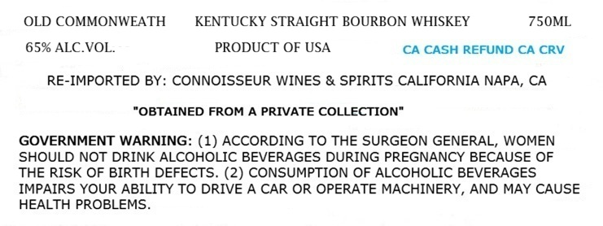
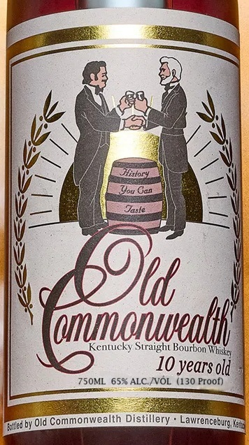

# TTB COLA Label Images - TTBID 26211001000409

**Brand Name:** OLD COMMONWEALTH

**Fanciful Name:** 10 YEARS OLD

**Issue Date:** 08/06/2026

**Origin Code:** 01

**Product Class/Type:** 101

**Source:** [TTB Public COLA Registry](https://ttbonline.gov/colasonline/viewColaDetails.do?action=publicFormDisplay&ttbid=26211001000409)

## Label Images

### Label 1

### Label 2

## Extracted Label Text

*Text extracted via OCR - may contain errors*

**Detected Proof:** 130
**Detected Age:** 10 Years

### Label 1

OLD COMMONWEATH
KENTUCKY STRAIGHT BOURBON WHISKEY
750ML
65% ALC.VOL.
PRODUCT OF USA
CA CASH REFUND CA CRV
RE-IMPORTED BY: CONNOISSEUR WINES & SPIRITS CALIFORNIA NAPA, CA
"OBTAINED FROM A PRIVATE COLLECTION"
GOVERNMENT WARNING: (1) ACCORDING TO THE SURGEON GENERAL, WOMEN
SHOULD NOT DRINK ALCOHOLIC BEVERAGES DURING PREGNANCY BECAUSE OF
THE RISK OF BIRTH DEFECTS. (2) CONSUMPTION OF ALCOHOLIC BEVERAGES
IMPAIRS YOUR ABILITY TO DRIVE A CAR OR OPERATE MACHINERY, AND MAY CAUSE
HEALTH PROBLEMS

### Label 2

Kilor"
You Can
Jasle
dunorueolhl |
Kentucky
Bourbon
10 years old
75OML
65% ALC NOL
(130 Proof)
by Old Commonwealth Distillery . Lawrencebure Es
Straight
Eved L
