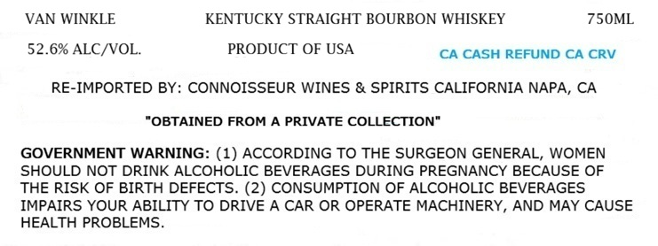
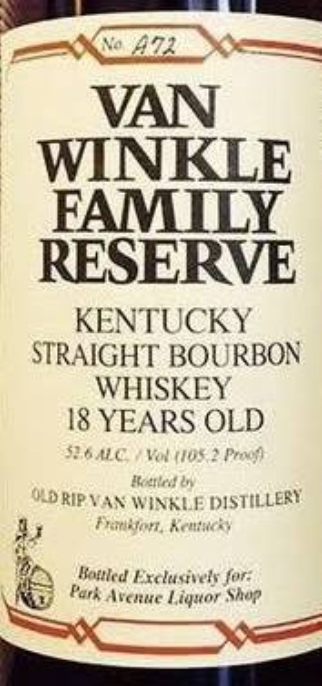

# TTB COLA Label Images - TTBID 26211001000414

**Brand Name:** VAN WINKLE

**Fanciful Name:** FAMILY RESERVE 18 YEARS OLD

**Issue Date:** 08/05/2026

**Origin Code:** 01

**Product Class/Type:** 101

**Source:** [TTB Public COLA Registry](https://ttbonline.gov/colasonline/viewColaDetails.do?action=publicFormDisplay&ttbid=26211001000414)

## Label Images

### Label 1

### Label 2

## Extracted Label Text

*Text extracted via OCR - may contain errors*

**Detected Proof:** 105.2

### Label 1

VAN WINKLE
KENTUCKY STRAIGHT BOURBON WHISKEY
75OML
52.6% ALC/VOL.
PRODUCT OF USA
CA CASH REFUND CA CRV
RE-IMPORTED BY: CONNOISSEUR WINES & SPIRITS CALIFORNIA NAPA, CA
"OBTAINED FROM A PRIVATE COLLECTION"
GOVERNMENT WARNING: (1) ACCORDING TO THE SURGEON GENERAL, WOMEN
SHOULD NOT DRINK ALCOHOLIC BEVERAGES DURING PREGNANCY BECAUSE OF
THE RISK OF BIRTH DEFECTS. (2) CONSUMPTION OF ALCOHOLIC BEVERAGES
IMPAIRS YOUR ABILITY TO DRIVE A CAR OR OPERATE MACHINERY, AND MAY CAUSE
HEALTH PROBLEMS

### Label 2

_ a SEY >
VAN
WINKLE
FAMILY
RESERVE
KENTUCKY
STRAIGHT BOURBON
WHISKEY
I$ YEARS OLD
SEG ALC / Val (108.2 Proof
MLD RIP VAN WINKLE DISTILLERY
ay Frimbfort, Keutucks
J seams
