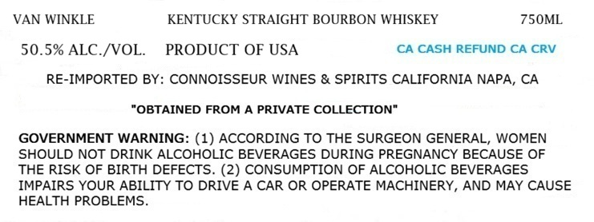
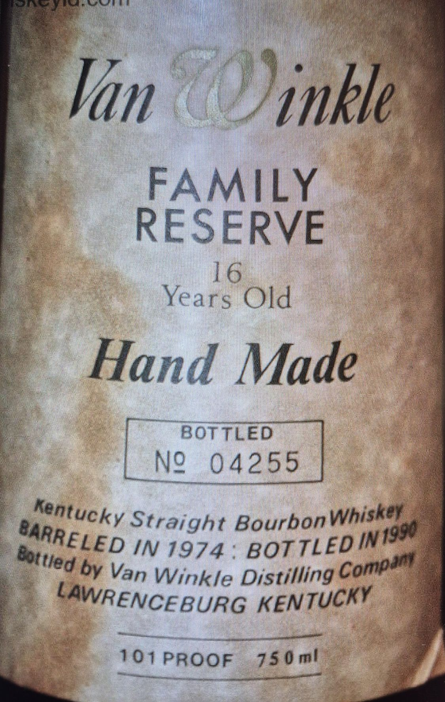

# TTB COLA Label Images - TTBID 26211001000422

**Brand Name:** VAN WINKLE

**Fanciful Name:** FAMILY RESERVE 16 YEAR OLD

**Issue Date:** 08/06/2026

**Origin Code:** 01

**Product Class/Type:** 101

**Source:** [TTB Public COLA Registry](https://ttbonline.gov/colasonline/viewColaDetails.do?action=publicFormDisplay&ttbid=26211001000422)

## Label Images

### Label 1

### Label 2

## Extracted Label Text

*Text extracted via OCR - may contain errors*

**Detected Proof:** 101

### Label 1

VAN WINKLE
KENTUCKY STRAIGHT BOURBON WHISKEY
75OML
50.5% ALC /VOL.
PRODUCT OF USA
CA CASH REFUND CA CRV
RE-IMPORTED BY: CONNOISSEUR WINES & SPIRITS CALIFORNIA NAPA, CA
"OBTAINED FROM A PRIVATE COLLECTION"
GOVERNMENT WARNING: (1) ACCORDING TO THE SURGEON GENERAL, WOMEN
SHOULD NOT DRINK ALCOHOLIC BEVERAGES DURING PREGNANCY BECAUSE OF
THE RISK OF BIRTH DEFECTS. (2) CONSUMPTION OF ALCOHOLIC BEVERAGES
IMPAIRS YOUR ABILITY TO DRIVE A CAR OR OPERATE MACHINERY, AND MAY CAUSE
HEALTH PROBLEMS

### Label 2

#LHHHWUH  HHNLHHKNHNuHHHKH
#inkle
FAMILY
RESERME
I6l
Yearis Old
Hand Made
BBOTTCEd
N?_042551
Straight BourbonWhisktr
IN 1974
by
Winkle Distilling
LAWRENCEBURG
101 PROOF 230ml
Van
Kentucky
BARRELED
BOTTLED IN+9508
Bottied
Compan
Van
KENTUCKY
