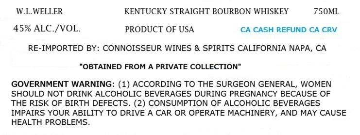
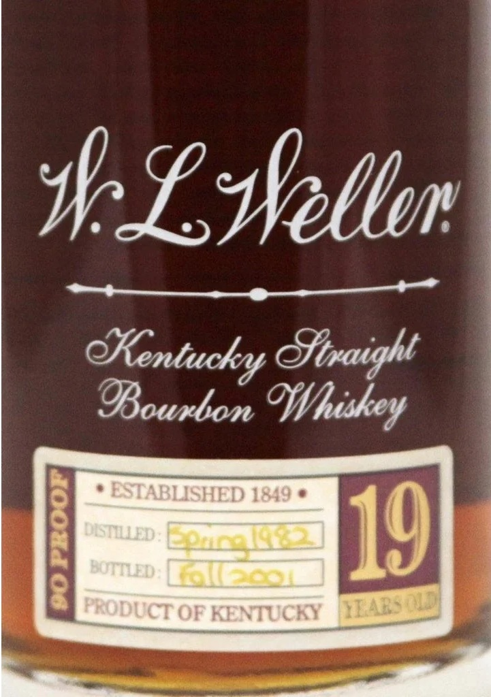

# TTB COLA Label Images - TTBID 26211001000437

**Brand Name:** W.L.WELLER

**Fanciful Name:** 19 YEARS OLD

**Issue Date:** 08/10/2026

**Origin Code:** 01

**Product Class/Type:** 101

**Source:** [TTB Public COLA Registry](https://ttbonline.gov/colasonline/viewColaDetails.do?action=publicFormDisplay&ttbid=26211001000437)

## Label Images

### Label 1

### Label 2

## Extracted Label Text

*Text extracted via OCR - may contain errors*

**Detected Proof:** 90

### Label 1

WLWELLER
KENTUCKY STRAIGHT BOURBON WHISKEY
750ML
45% ALC /VOL.
PRODUCT OF USA
CA CASH REFUND CA CRV
RE-IMPORTED BY: CONNOISSEUR WINES & SPIRITS CALIFORNIA NAPA, CA
"OBTAINED FROM A PRIVATE COLLECTION"
GOVERNMENT WARNING: (1) ACCORDING TO THE SURGEON GENERAL, WOMEN
SHOULD NOT DRINK ALCOHOLIC BEVERAGES DURING PREGNANCY BECAUSE OF
THE RISK OF BIRTH DEFECTS. (2) CONSUMPTION OF ALCOHOLIC BEVERAGES
IMPAIRS YOUR ABILITY TO DRIVE A CAR OR OPERATE MACHINERY, AND MAY CAUSE
HEALTH PROBLEMS

### Label 2

"8Sskellen
OKentuckr Sftraight
ESTABLISHED 1849
BOTTED;
J
1
209
19
PRODUCT OF KENTUCKY
OBoubon
OWNhiskey
DESTILED :
IAR: wbI
