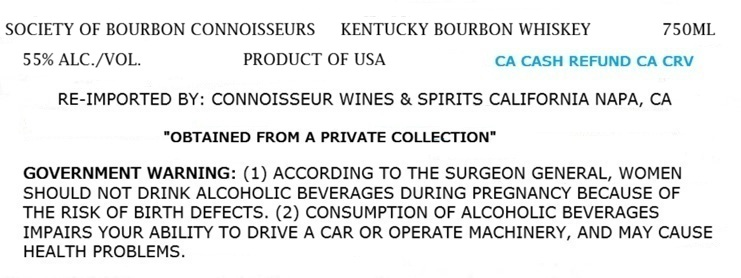
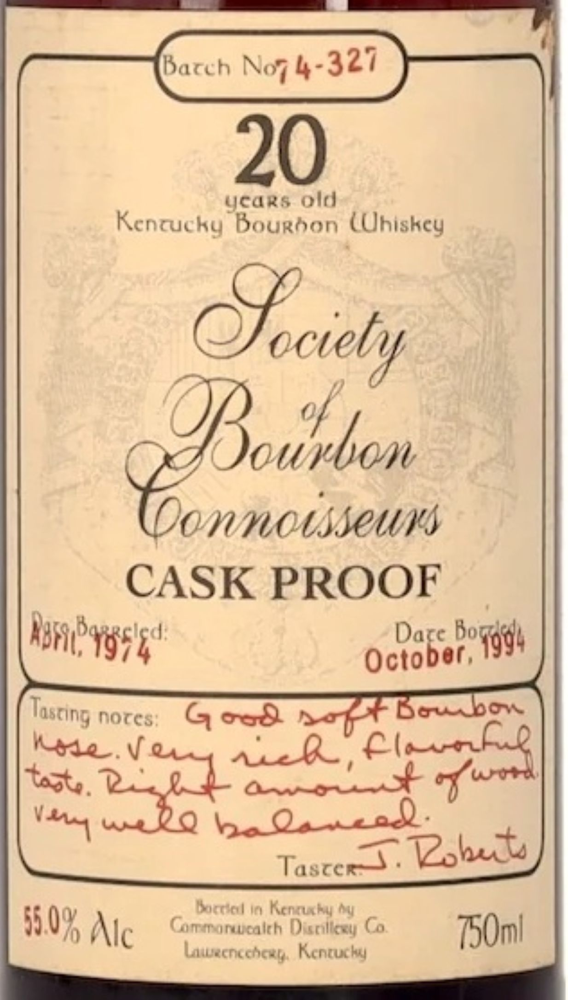

# TTB COLA Label Images - TTBID 26211001000446

**Brand Name:** SOCIETY OF BOURBON CONNOISSEURS

**Fanciful Name:** 20 YEARS OLD

**Issue Date:** 08/05/2026

**Origin Code:** 01

**Product Class/Type:** 141

**Source:** [TTB Public COLA Registry](https://ttbonline.gov/colasonline/viewColaDetails.do?action=publicFormDisplay&ttbid=26211001000446)

## Label Images

### Label 1

### Label 2

## Extracted Label Text

*Text extracted via OCR - may contain errors*

### Label 1

SOCIETY OF BOURBON CONNOISSEURS
KENTUCKY BOURBON WHISKEY
750ML
559 ALC /VOL.
PRODUCT OF USA
CA CASH REFUND CA CRV
RE-IMPORTED BY: CONNOISSEUR WINES & SPIRITS CALIFORNIA NAPA, CA
"OBTAINED FROM A PRIVATE COLLECTION"
GOVERNMENT WARNING: (1) ACCORDING TO THE SURGEON GENERAL, WOMEN
SHOULD NOT DRINK ALCOHOLIC BEVERAGES DURING PREGNANCY BECAUSE OF
THE RISK OF BIRTH DEFECTS. (2) CONSUMPTION OF ALCOHOLIC BEVERAGES
IMPAIRS YOUR ABILITY TO DRIVE A CAR OR OPERATE MACHINERY, AND MAY CAUSE
HEALTH PROBLEMS

### Label 2

years old

Kenruc ky Bourdon (Uhiskey

—

0 ibaa

ONNOASSUWMS

CASK PROOF

Dare bo

alec

October,

qa

Tasting

4

hores

G ood

fot 6

Kode Vf

‘Amine

Tasty

en

ome

ects

Tiare

: = kf | , sie he Co

WR Alc |

1

cohean, Kenruc

Bn!
