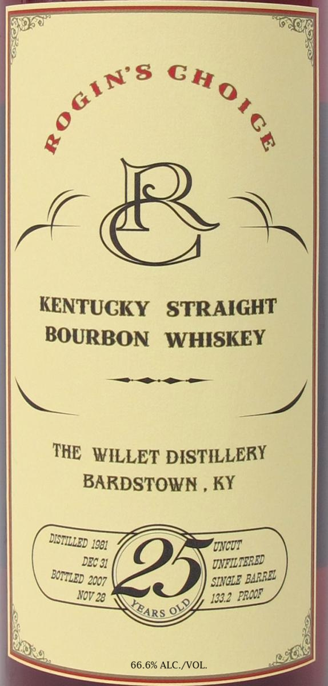

# TTB COLA Label Images - TTBID 26211001000458

**Brand Name:** ROGIN'S CHOICE

**Fanciful Name:** 25 YEARS OLD

**Issue Date:** 08/05/2026

**Origin Code:** 01

**Product Class/Type:** 101

**Source:** [TTB Public COLA Registry](https://ttbonline.gov/colasonline/viewColaDetails.do?action=publicFormDisplay&ttbid=26211001000458)

## Label Images

### Label 1

### Label 2

## Extracted Label Text

*Text extracted via OCR - may contain errors*

**Detected Proof:** 133.2

### Label 1

KENTUCKY
STRAIGHT
BOURBON   WHISKEY
THE WILLET DISTILLERY
BARDSTOWN
KY
1981
'UNCUT
DEC 31
95
UNFILTERED
2007
SINGLE
NoV 28
1332
66.6% ALC NOL_
&OGIN $
choice
DISTILLED
BOITLED
BARRZL
PRODF
OLD
XEARS

### Label 2

RE-IMPORTED BY: CONNOISSEUR WINES & SPIRITS CALIFORNIA NAPA,CA

"OBTAINED FROM A PRIVATE COLLECTION"

CACASHED REFUND CACRV

GOVERNMENT WARNING: (1) ACCORDING TO THE SURGEON GENERAL, WOMEN

SHOULD NOT DRINK ALCOHOLIC BEVERAGES DURING PREGNANCY BECAUSE OF THE

RISK OF BIRTH DEFECTS. (2) CONSUMPTION OF ALCOHOLIC BEVERAGES IMPAIRS YOUR

ABILITY TO DRIVE A CAR OR OPERATE MACHINERY, AND MAY CAUSE HEALTH PROBLEMS.
