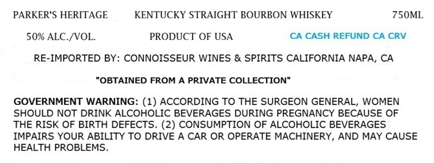
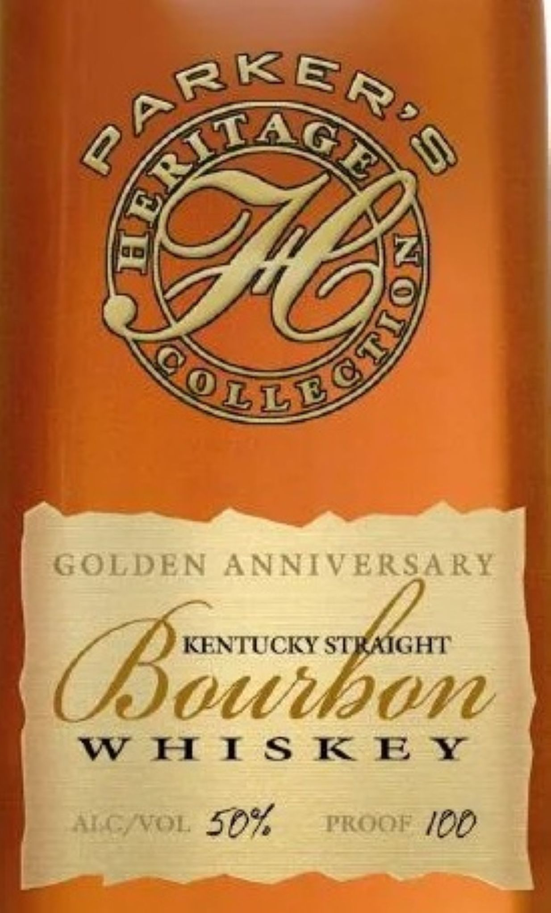

# TTB COLA Label Images - TTBID 26211001000466

**Brand Name:** PARKER'S HERITAGE

**Fanciful Name:** GOLDEN ANNIVERSARY

**Issue Date:** 08/05/2026

**Origin Code:** 01

**Product Class/Type:** 101

**Source:** [TTB Public COLA Registry](https://ttbonline.gov/colasonline/viewColaDetails.do?action=publicFormDisplay&ttbid=26211001000466)

## Label Images

### Label 1

### Label 2

## Extracted Label Text

*Text extracted via OCR - may contain errors*

**Detected Proof:** 100

### Label 1

PARKER'S HERITAGE
KENTUCKY STRAIGHT BOURBON WHISKEY
750ML
50% ALC NVOL_
PRODUCT OF USA
CA CASH REFUND CA CRV
RE-IMPORTED BY: CONNOISSEUR WINES & SPIRITS CALIFORNIA NAPA, CA
"OBTAINED FROM A PRIVATE COLLECTION"
GOVERNMENT WARNING: (1) ACCORDING TO THE SURGEON GENERAL, WOMEN
SHOULD NOT DRINK ALCOHOLIC BEVERAGES DURING PREGNANCY BECAUSE OF
THE RISK OF BIRTH DEFECTS. (2) CONSUMPTION OF ALCOHOLIC BEVERAGES
IMPAIRS YOUR ABILITY TO DRIVE A CAR OR OPERATE MACHINERY, AND MAY CAUSE
HEALTH PROBLEMS

### Label 2

q

-

IE

wy

&

CG Wo

c~

g

ie

SS

YC

oie

iS

rs

Wer

ce.

OTT

GOLDEN ANNIVERSARY

—

f KENTUCKY

GHT

SOUMUIOWNW

wwe tS Key

ALG/VvoL 52%

PROOF (DP
