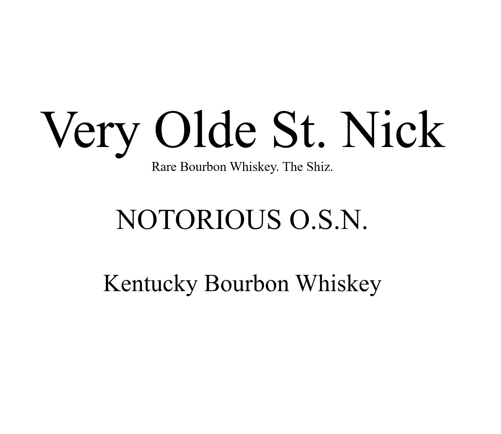
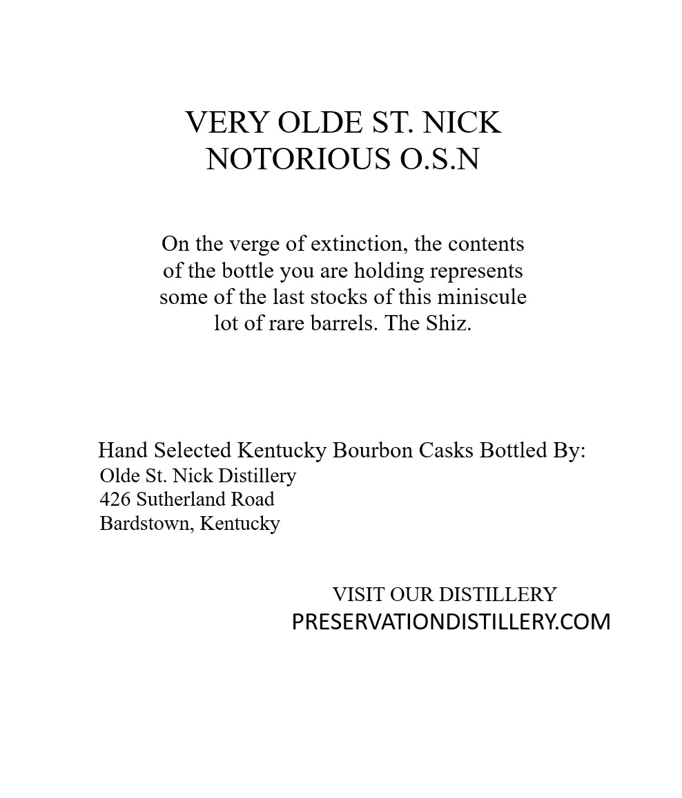
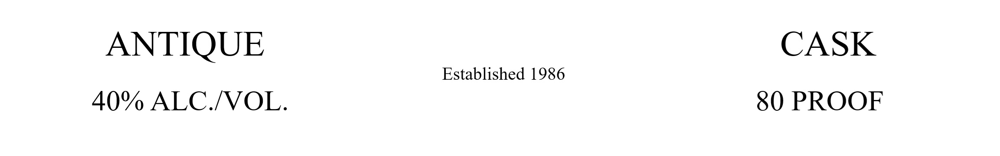
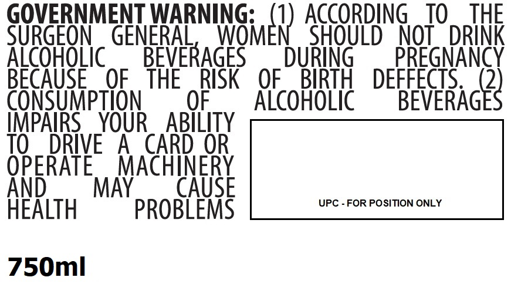

# TTB COLA Label Images - TTBID 26211001000507

**Brand Name:** VERY OLDE ST. NICK

**Issue Date:** 08/06/2026

**Origin Code:** 22

**Product Class/Type:** 141

**Source:** [TTB Public COLA Registry](https://ttbonline.gov/colasonline/viewColaDetails.do?action=publicFormDisplay&ttbid=26211001000507)

## Label Images

### Back Label

### Label 1

### Label 3

### Label 4

## Extracted Label Text

*Text extracted via OCR - may contain errors*

*1 image(s) excluded: text did not meet readability threshold*

### Back Label

Olde St. Nick
Rare Bourbon
Whiskey: The Shiz
NOTORIOUS O.S.N.
Kentucky Bourbon Whiskey
Very

### Label 1

VERY OLDE ST NICK
NOTORIOUS O.S.N
On the verge of extinction; the contents
of the bottle you are
holding represents
some of the last stocks of this miniscule
lot of rare barrels. The Shiz.
Hand Selected Kentucky Bourbon Casks Bottled
Olde St: Nick Distillery
426 Sutherland Road
Bardstown; Kentucky
VISIT OUR DISTILLERY
PRESERVATIONDISTILLERYCOM
By:

### Label 4

GOVERNMENT WARNING:
ACCORDING
TO
THE
SURGEON
GENERAL
WNGmer) ,
SHOULD
NOT
DRINK
AicoHoLic
BEVERAGES
DURiNG
PREGNANCY
BECAUSE
OF
THE
RISK
OF
BIRTH
DEFFECTS
2
CONSUMpTION
OF
AlcohoLic
BEVERAGES
IMPAIRS
YOUR
ABILITY
TO
DRIVE
A
CARD OR
OPERATE
MACHINERY
And
MAY
CAUSE
UPC - FOR POSITION ONLY
HEALTH
PROBLEMS
750ml
