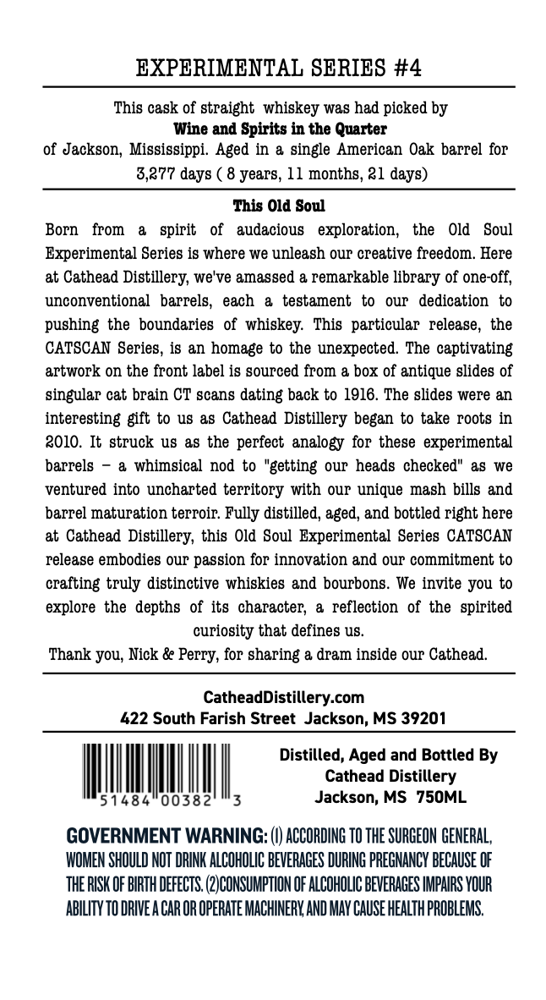
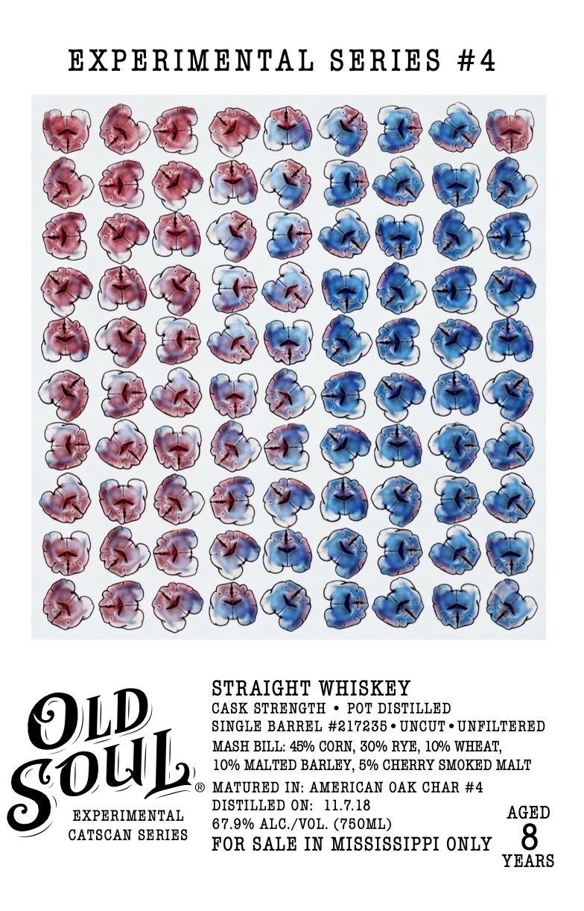

# TTB COLA Label Images - TTBID 26211001000509

**Brand Name:** OLD SOUL

**Fanciful Name:** EXPERIMENTAL SERIES

**Issue Date:** 08/13/2026

**Origin Code:** 28

**Product Class/Type:** 100

**Source:** [TTB Public COLA Registry](https://ttbonline.gov/colasonline/viewColaDetails.do?action=publicFormDisplay&ttbid=26211001000509)

## Label Images

### Back Label

### Front Label

## Extracted Label Text

*Text extracted via OCR - may contain errors*

**Detected Proof:** 135.8
**Detected Age:** 8 Years

### Back Label

EXPERIMENTAL SERIES #4
This cask of straight  whiskey was had picked by
Wine and Spirits in the Quarter
of Jackson, Mississippi  Aged in & single American Oak barrel for
3,277 days ( 8 years, 11 months, ?1 days)
This Old Soul
Born
from
spirit
of
audacious
exploration;,
the
Old
Soul
Experimental Series is where we unleagh Our creative freedom. Here
at Cathead Distillery; we've amassed & remarkable library of one-off;,
unconventional   barrels,  each
a   testament to
our   dedication to
pushing the boundaries   of whiskey:   This  particular  release, the
CATSCAN Series, is an homage to the unexpected  The captivating
artwork on the front label is gourced from & box of antique glides of
singular cat brain CT scans dating back to 1916. The slides were &n
interesting gft to u8 &s Cathead Distillery began to take roots in
8010. It struck us &8 the perfect analogy for these experimental
barrels
a whimsical nod to "getting our heads checked" &8 we
ventured into uncharted territory with
Our
unique mash bills and
barrel maturation terroir Fully distilled, aged, and bottled right here
at Cathead
Distillery, this Old Soul  Experimental Series CATSCAN
release embodies OuT passion for innovation and OuP commitment to
crafting truly distinctive whiskies and bourbons. We invite you to
explore the depths of its  character;
a   reflection  of the   spirited
curiosity that defines u8_
Thank you; Nick & Perry, for sharing & dram inside our Cathead.
CatheadDistillery com
422 South Farish Street Jackson, MS 39201
Distilled; Aged and Bottled By
Cathead Distillery
51484"00382
Jackson; MS
75OML
GOVERNMENT WARNING: () ACCORDING TO THE SURCEON GENERAL,
WOMEN SHOULD NOT DRINK ALCOHOLIC BEVERAGES DURING PREGNANCY BECAUSE OF
THE RISK OF BIRTH DEFECTS (2 CONSUMPTION OF ALCOHOLIc BEVERAGES IMPAIRS VOUR
AbiLITy TO DRIVE A CAR OR OPERATE MACHINERK AND MAY CAUSE HEALTh PROBLEMS,

### Front Label

EXPERIMENTAL SBRIES #4
STRAIGHT WHISKEY
CASK STRENGTH
POT DISTILLED
OL)
SINGLE BARREL #217235
UNCUT
UNFILTERED
MASH BILL: 45% CORN, 30% RYE , 10 WHEAT,
10% MALTED BARLEY, 5% CHERRY SMOKED MALT
MATURED IN: AMERICAN OAK CHAR #4
DISTILLED ON:
11.7.18
AGED
EXPERIMENTAL
67.9% ALC /VOL. (750ML)
CATSCAN SERIES
FOR SALE IN MISSISSIPPI ONLY
8
YBARS
SOUL
