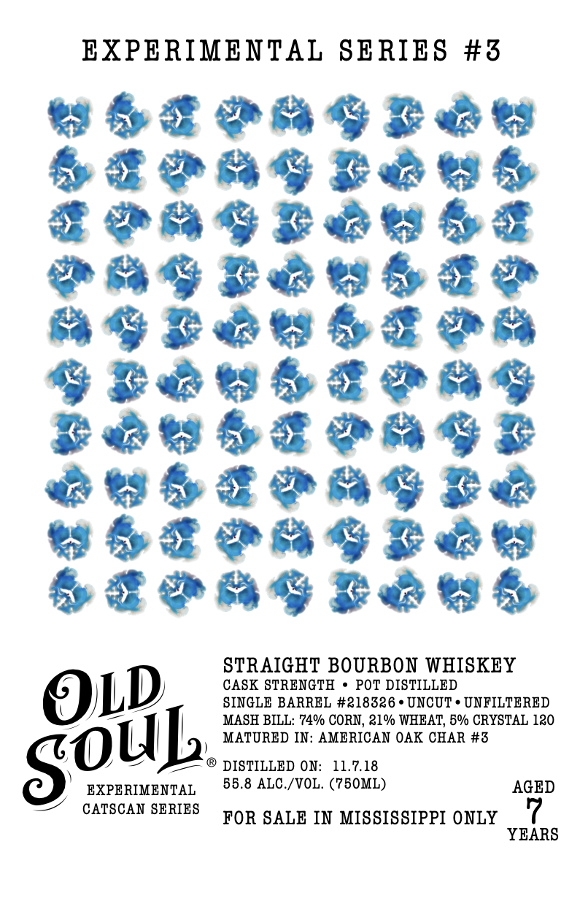
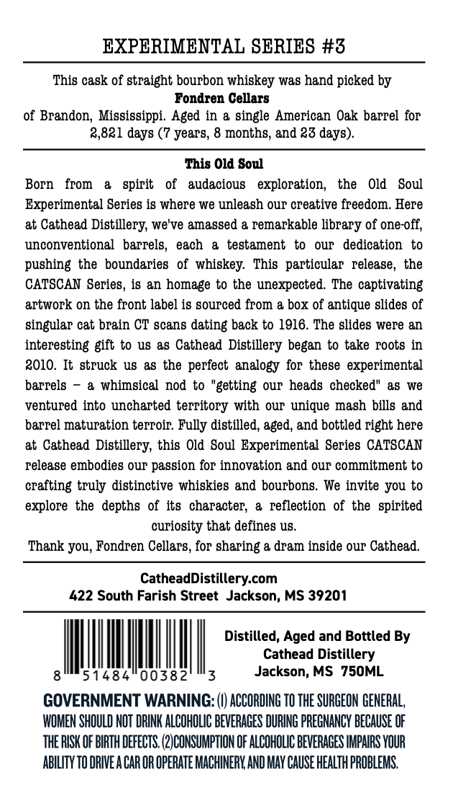

# TTB COLA Label Images - TTBID 26211001000513

**Brand Name:** OLD SOUL

**Fanciful Name:** EXPERIMENTAL SERIES

**Issue Date:** 08/06/2026

**Origin Code:** 28

**Product Class/Type:** 101

**Source:** [TTB Public COLA Registry](https://ttbonline.gov/colasonline/viewColaDetails.do?action=publicFormDisplay&ttbid=26211001000513)

## Label Images

### Label 1

### Label 2

## Extracted Label Text

*Text extracted via OCR - may contain errors*

**Detected Age:** 7 Years

### Label 1

EXPERIMBNTAL SERIES #3
360
Res
4e
740s
74060
646&
36e
640s
40s
STRAIGHT BOURBON WHISKEY
CASK STRENGTH
POT DISTILLED
OL)
SINGLE BARREL #218326
UNCUT
UNFILTERED
MASH BILL: 74% CORN, 21% WHEAT, 5% CRYSTAL 120
MATURED IN: AMERICAN OAK CHAR #3
DISTILLED ON:
11.7.18
EXPERIMENTAL
55.8 ALC /VOL. (750ML)
AGED
CATSCAN SERIES
FOR SALE IN MISSISSIPPI ONLY
YEARS
SOUL

### Label 2

EXPERIMENTAL SERIES #3
This cask of straight bourbon whiskey was hand picked by
Fondren Cellars
of Brandon, Mississippi. Aged in & single American Oak barrel for
2,821 days (7 years, 8 months; and ?3 days)
This Old Soul
Born
from
spirit
of
audacious
exploration;
the
Old
Soul
Experimental Series is where we unleash OUP creative freedom. Here
at Cathead Distillery; we've amassed & remarkable library 0f one-off,
unconventional   barrels,
each
testament
our
dedication
to
pushing the boundaries  of whiskey:
This   particular  release, the
CATSCAN Series, is an homage to the unexpected. The captivating
artwork on the front label is gourced from & box of antique slides of
singular cat brain CT gcans dating back to 1916. The slides were an
interesting gift to us &8 Cathead  Distillery began to take roots in
2010. It struck u8 &s the perfect analogy for these  experimental
barrels
a whimsical  nod to "getting
our heads checked" as
we
ventured into uncharted territory with OUr unique magh bills and
barrel maturation terroir: Fully distilled; aged, and bottled right here
at Cathead
Distillery, this Old Soul Experimental Series CATSCAN
release embodies Our passion for innovation and OuT commitment to
crafting truly distinctive whiskies and bourbons
We invite you to
explore the depths of its   character;
a   reflection  of the  spirited
curiosity that defines uS.
Thank you; Fondren Cellars; for sharing & dram inside our Cathead.
CatheadDistillery.com
422 South Farish Street  Jackson; MS 39201
Distilled, Aged and Bottled By
Cathead
Distillery
51484
00382
Jackson; MS 750ML
GOVERNMENT WARNING: (0) ACCORDING TO THE SURGEON GENERAL,
WOMEN SHOULD NOT DRINK ALCOHOLIC BEVERAGES DURING PREGNANCY bECaUSE OF
The RISK OF BIRTH DEFECTS; (2JCONSUMPTION OF ALCOHOLIC BEVERAGES IMPAIRS VOUR
AbILITY TO DRIVE A CAR OR OPERATE MACHINERY AND MAY CAUSE HEALTH PROBLEMS.
