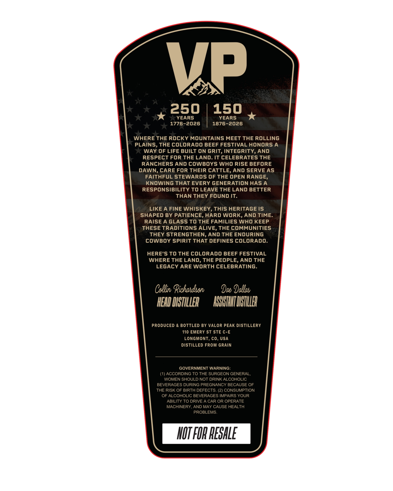
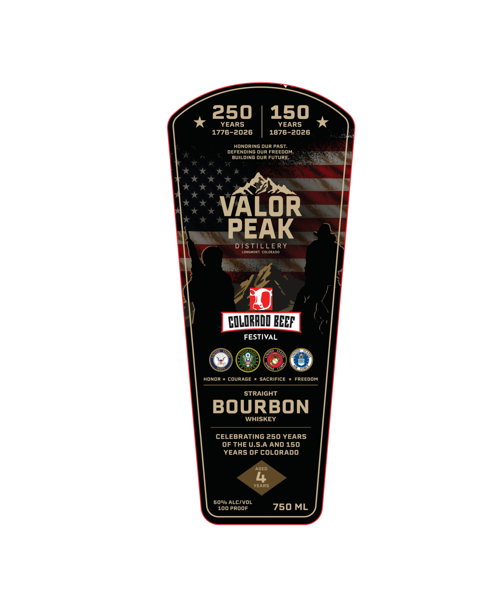

# TTB COLA Label Images - TTBID 26211001000678

**Brand Name:** VALOR PEAK DISTILLERY

**Issue Date:** 08/06/2026

**Origin Code:** 13

**Product Class/Type:** 101

**Source:** [TTB Public COLA Registry](https://ttbonline.gov/colasonline/viewColaDetails.do?action=publicFormDisplay&ttbid=26211001000678)

## Label Images

### Back Label

### Front Label

## Extracted Label Text

*Text extracted via OCR - may contain errors*

**Detected Proof:** 100

### Back Label

Vp
250
150
YEARS
YEARS
1776-2026
1876-2026
WHERE THE ROCKY MOUNTAINS MEET THE ROLLING
PLAINS, THE COLORADO BEEF FESTIVAL HONORS A
WAY OF LIFE BUILT ON GRIT; INTEGRITY, AND
RESPECT FOR THE LAND: IT CELEBRATES THE
RANCHERS AND COWBOYS WHO RISE BEFORE
DAWN, CARE FOR THEIR CATTLE, AND SERVE AS
FAITHFUL STEWARDS OF THE OPEN RANGE,
KNOWING THAT EVERY GENERATION HAS A
RESPONSIBILITY TO LEAVE THE LAND BETTER
THAN THEY FOUND IT:
LIKE A FINE WHISKEY
ThIS HERITAGE IS
SHAPED BY PATIENCE
HARD WORK, AND TIME_
RAISE A GLASS TO THE FAMILIES WHO KEEP
THESE TRADITIONS ALIVE, THE COMMUNITIES
THEY STRENGTHEN, AND THE ENDURING
COWBOY SPIRIT THAT DEFINES COLORADO:
HERE'S TO THE COLORADO BEEF FESTIVAL
WHERE THE LAND, THE PEOPLE, AND THE
LEGACY ARE WORTH CELEBRATING.
Csblinv Richandscnu
Dae Dallab
HEAD DISTILLER
RSHSTIHTDBSTLLER
PRODUCED & BOTTLED BY VALOR PEAK DISTILLERY
110 EMERY ST STE C-E
LONGMONT, co, USA
DISTILLED FROM GRAIN
GOVERNMENT WARNING:
(1) ACCORDING TO THE SURGEON GENERAL
WOMEN SHOULD NOT DRINK ALCOHOLIC
BEVERAGES DURING PREGNANCY BECAUSE OF
THE RISK OF BIRTH DEFECTS: (2) CONSUMPTION
OF ALCOHOLIC BEVERAGES IMPAIRS YOUR
ABILITY TO DRIVE A CAR OR OPERATE
MACHINERY, AND MAY CAUSE HEALTH
PROBLEMS;
HOT FOR PESHLE

### Front Label

250
150
YEARS
YEARS
1776-2026
1876-2026
HONORING OUR PAST.
DEFENDING ouR FREEDOM_
BUILDING ouR FuTuRE
VALOR
PEAK
DISTILLERY
LONGHONT COLORado
COLRADD BEBF
FESTIVAL
HONOR * COURAGE
SACRIFICE
FREEDOM
STRAIGHT
BOURBON
WHISKEY
CELEBRATING 250 YEARS
OF THE U.SA AND 150
YEARS OF COLORADO
AGED
YEARS
500/0 ALCIVOL
100 PROOF
750 ML
