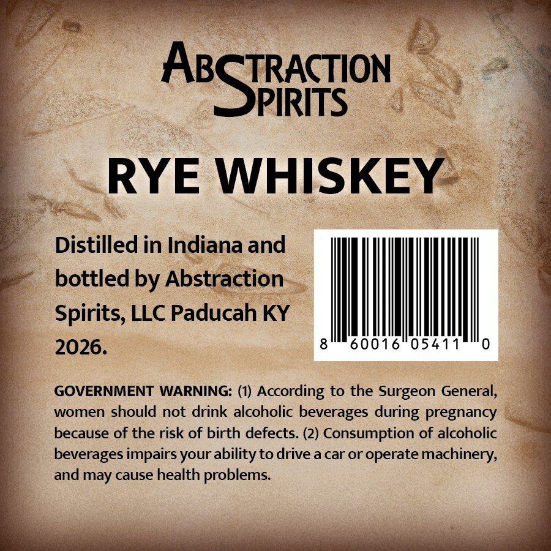
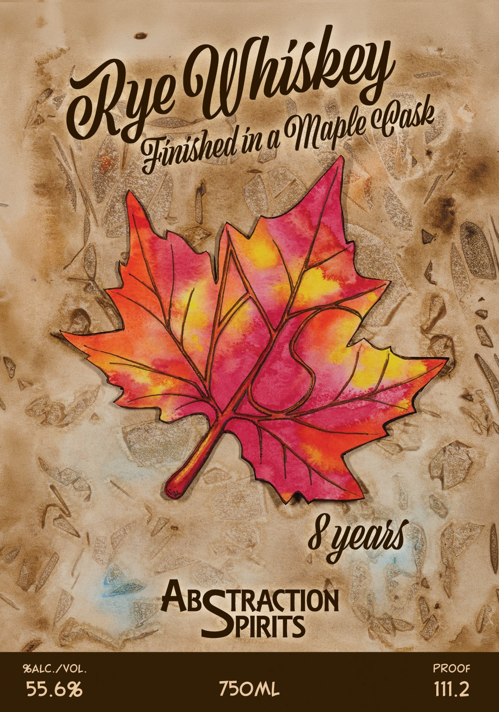

# TTB COLA Label Images - TTBID 26211001000698

**Brand Name:** ABSTRACTION SPIRITS

**Fanciful Name:** MAPLE RYE

**Issue Date:** 08/10/2026

**Origin Code:** 22

**Product Class/Type:** 142

**Source:** [TTB Public COLA Registry](https://ttbonline.gov/colasonline/viewColaDetails.do?action=publicFormDisplay&ttbid=26211001000698)

## Label Images

### Back Label

### Front Label

## Extracted Label Text

*Text extracted via OCR - may contain errors*

*1 image(s) excluded: text did not meet readability threshold*

### Back Label

A:SPRoN
RYE WHISKEY
Distilled in Indiana and
bottled by Abstraction
Spirits, LLC Paducah KY
2026.
8
60016
054
0
GOVERNMENT WARNING: (1)
According to the Surgeon General,
women should not drink alcoholic beverages
pregnancy
because of the risk of birth defects (2) Consumption of alcoholic
beverages impairs your ability to drive a car or operate machinery;
and may cause health problems:
during
